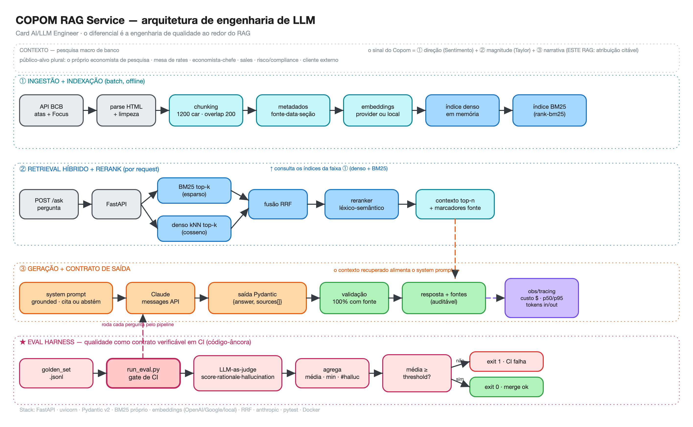

{width=100%}

::: {.callout-important}
## Estado atual — motor implementado, gate no melhor ponto

O **motor está completo e roda de ponta a ponta**: retrieval híbrido real
(BM25 + denso + RRF + rerank) sobre **862 chunks** — 814 de **48 atas completas**
(reuniões 232–279) e 48 do **Focus** —, geração via Claude e juiz LLM com
*self-consistency*.

| Verificação | Resultado |
|---|---|
| Eval harness (`--samples 3`, API real) | **8/8 casos com nota 1,000** |
| Alucinações | **0** |
| *Gate* (threshold $0{,}70$) | **PASSOU** |
| Suíte de testes | **31 testes verdes** |

O eval também roda **offline e sem custo**: sem `ANTHROPIC_API_KEY`, geração e
juiz degradam para modos determinísticos (extrativo / heurístico), e a
degradação é **registrada no trace** (`degraded: true`) em vez de silenciada.

**O que ainda falta:** plugar o gate como *GitHub Action* a cada PR (hoje ele
roda por linha de comando), atas anteriores à reunião 232, exportador
OpenTelemetry/Prometheus de fato (hoje o sink é JSONL, que é o formato que eles
consomem) e embeddings via *provider* (hoje há *fallback* local).
:::

## Visão Geral

Este projeto implementa, seguindo a metodologia **CRISP-DM** (*Cross-Industry
Standard Process for Data Mining*), um **serviço de RAG** (*Retrieval-Augmented
Generation*) sobre as **atas do Comitê de Política Monetária (Copom)** e o
**boletim Focus** do Banco Central do Brasil, exposto como **API** (FastAPI +
Docker).

A pergunta do usuário — em linguagem natural, sobre política monetária
brasileira — é respondida com fundamentação recuperada das atas e do Focus, e a
resposta **cita as fontes** usadas. Em um domínio onde um número errado (Selic,
meta de inflação, projeção) é uma falha grave, auditabilidade e ausência de
alucinação são requisitos, não enfeites.

O contexto de uso imaginado é o de um **departamento de pesquisa macroeconômica
de banco**: o objetivo é **comprimir o tempo entre a fonte primária (a ata que
acabou de sair) e uma leitura defensável e rastreável** que a **mesa de operação**
possa usar para posicionar em juros. Não se trata de "prever a Selic" — a
convicção direcional continua sendo do economista —, mas de dar ao *research* e à
mesa um copiloto de leitura testado e auditável. A seção de
[Motivação](#motivação) detalha os públicos-alvo e a tese de negócio.

O diferencial do projeto, contudo, **não é o RAG em si** — montar um RAG é
tarefa de uma tarde. É a **engenharia de qualidade ao redor dele**:

- um **eval harness** com *golden set*, **LLM-as-judge** com *self-consistency*
  e um **gate** que **falha (exit 1)** se a qualidade média regride;
- **observability** de custo, latência, *tokens* e **degradação** por *request*;
- empacotamento como **API + Docker**, pronto para subir com um comando.

> **Repositório:** [github.com/vitorwilher/copom-rag-service](https://github.com/vitorwilher/copom-rag-service) ·
> **Site do projeto:** [vitorwilher.github.io/copom-rag-service](https://vitorwilher.github.io/copom-rag-service/)

::: {.callout-tip}
## Tese central

Um RAG de política monetária não se prova por uma *demo* bonita — prova-se por
**não regredir**. A postura de engenharia deste projeto é tratar qualidade de
resposta como um **contrato verificável em CI**: o *golden set* + LLM-as-judge
produzem um score agregado, e nenhuma mudança entra sem que a média se mantenha
acima do *threshold*. O **código-âncora** do card é, portanto, o `run_eval.py` —
o *gate* que transforma "parece bom" em "passou ou falhou".
:::

---

## Motivação

### O problema de negócio: da fonte primária à leitura defensável

Imagine este projeto dentro do **departamento de pesquisa macroeconômica de um
grande banco brasileiro** — um Itaú, Bradesco, Santander, Banco do Brasil ou
Nubank. Um time de macro produz, essencialmente, três coisas: **cenário** (para
onde vão Selic, câmbio, inflação e atividade), **calls** (recomendações táticas
para as mesas) e **atendimento** a clientes internos e externos. O gargalo
crônico não é *ter* a opinião — é a **velocidade e a rastreabilidade** entre "o
Banco Central falou" e "a mesa agiu com base numa leitura defensável".

O cliente interno mais crítico é a **mesa de operação** (juros / *rates*). Assim
que uma ata do Copom sai, ela precisa responder, em minutos, três perguntas cujo
resultado move preço:

1. **O que mudou** no comunicado/ata em relação ao anterior — *forward guidance*,
   balanço de riscos, assimetria do cenário;
2. **Isso confirma ou contradiz o que o mercado já espera** — o *gap* entre a
   comunicação do Copom e a mediana do **Focus** é, literalmente, fonte de alfa
   para uma posição em DI/pré;
3. **Qual a base textual** dessa leitura — para tomar risco, a mesa precisa poder
   clicar na frase da ata que sustenta a interpretação.

Este serviço **não substitui** o economista sênior que forma o cenário; a
convicção direcional (o *call* de "corta 50 vs. 25") continua sendo humana. O que
ele faz é **industrializar a camada de leitura de fontes primárias** (atas +
Focus) que hoje é feita no braço, sob pressão de tempo, e cujo raciocínio
raramente fica documentado. É um **copiloto de leitura**, não o piloto do
cenário — e a diferença para um *chatbot* genérico é que aqui as fontes são o
Copom e o Focus, **versionados**, e a resposta é **auditável e testada**.

### Por que o eval harness é o que dá "licença de operar" num banco

Numa instituição regulada, uma ferramenta que gera leitura de política monetária
para embasar posição de risco tem um problema óbvio: **e se ela alucinar?** Um
economista que inventa uma frase que o Copom não disse — e a mesa monta centenas
de milhões em DI em cima disso — é um **incidente**. O *golden set* + LLM-as-judge
+ gate de CI que **reprova se a qualidade regride** é a resposta institucional
para "como você garante que essa coisa não me faz tomar decisão sobre fato
inventado?". Neste projeto, a engenharia de avaliação não é só boa prática de
*software*: é **governança de modelo e gestão de risco disfarçadas de código** —
a diferença entre um brinquedo e algo que passa no **comitê de modelos**.

### As perguntas de engenharia por trás disso

Tecnicamente, sistemas de RAG são fáceis de montar e difíceis de manter honestos.
Uma troca de modelo, um ajuste de *prompt*, uma mudança no *chunking* ou no
*reranker* podem melhorar três respostas e piorar outras dez — sem que ninguém
perceba até um usuário reclamar. O projeto responde, então, a três perguntas
práticas de engenharia de LLM que espelham as três dores de negócio acima:

1. **Como impedir regressão de qualidade** em um serviço de RAG a cada mudança?
2. **Quanto custa, quão rápido e quantos *tokens* consome** cada resposta —
   métrica de produto num *research* que vive de orçamento e de SLA?
3. **Como garantir auditabilidade** — que cada resposta seja rastreável às atas
   ou ao Focus que a fundamentam?

---

## Metodologia — CRISP-DM

O projeto foi estruturado seguindo o processo **CRISP-DM**, adaptado ao contexto
de **engenharia de LLM / RAG aplicado à comunicação de bancos centrais**.

| Fase | Aplicação no Projeto |
|---|---|
| **1. Entendimento do Negócio** | Responder perguntas sobre política monetária com fundamentação auditável (fontes citadas) e sem alucinação numérica; definir qualidade como contrato verificável em CI |
| **2. Entendimento dos Dados** | 48 atas completas (232–279) + Focus ancorado à véspera de cada reunião; jargão de política monetária e números sensíveis (Selic, projeções) |
| **3. Preparação dos Dados** | *Chunking* em 862 unidades com proveniência; indexação **esparsa** (BM25) e **densa** (embeddings + cosseno), ambas enriquecidas com ata/reunião/data |
| **4. Modelagem** | **Retrieval híbrido** BM25 + denso → **RRF** → **reranker** → *prompt* → geração via Claude, com saída estruturada (resposta + fontes) via Pydantic |
| **5. Avaliação** | **Eval harness**: *golden set* de fatos ancorados e abstenções + **LLM-as-judge** com *self-consistency* + **gate** que falha em regressão |
| **6. Implantação** | **API FastAPI + Docker/compose**; **observability** de custo/latência/*tokens* por *request* |

---

## Arquitetura

```{mermaid}
flowchart LR
  subgraph Ingestao["Ingestão — API do BCB"]
    ATAS[(48 atas completas<br>reuniões 232–279)] --> ING["ingest.py"]
    FOCUS[(Focus na véspera<br>de cada reunião)] --> ING
    ING --> CORP[("corpus.jsonl<br>862 chunks<br>814 atas + 48 Focus")]
  end

  Q[POST /ask<br>pergunta] --> API[FastAPI]
  API --> PIPE[RAGPipeline]

  subgraph Retrieval["Retrieval híbrido"]
    CORP --> IDX["indexing_text()<br>+ ata · reunião · data"]
    IDX --> BM25["BM25<br>esparso"]
    IDX --> DENSE["Denso<br>embeddings + cosseno"]
    PIPE --> BM25
    PIPE --> DENSE
    BM25 --> FUSE["Fusão RRF"]
    DENSE --> FUSE
    FUSE --> RR["Reranker<br>boost de decisão condicional"]
  end

  RR --> GEN["Claude Haiku 4.5<br>resposta + fontes"]
  GEN -->|"sem chave"| EXT["fallback extrativo<br>degraded: true"]
  GEN --> API
  API --> R[resposta + fontes]

  subgraph Qualidade["Eval harness — o código-âncora"]
    GS[("golden_set.jsonl<br>5 fatos + 3 abstenções")] --> RUN["run_eval.py"]
    RUN --> PIPE2[RAGPipeline]
    PIPE2 --> JUDGE["Claude Sonnet 5<br>self-consistency (N=3)<br>mediana + voto maioria"]
    JUDGE --> GATE{"média ≥ threshold?"}
    GATE -->|não| FAIL["exit 1 — reprova"]
    GATE -->|sim| PASS["exit 0 — passa"]
  end

  API -. custo · latência · tokens · degraded .-> OBS["obs/tracing<br>sink JSONL"]
  JUDGE -. .-> OBS
```

---

## 1. Entendimento do Negócio

### 1.1 Problema

Servir um assistente de RAG sobre política monetária é, antes de tudo, um
problema de **confiabilidade**. A comunicação do Copom concentra, em escolhas
sutis de linguagem e em números precisos, informação relevante sobre a direção
da Selic — e política monetária no Brasil é, cada vez mais, um exercício de
**interpretar comunicação** (o Copom fala para ancorar expectativas). Uma
ferramenta que leia essa comunicação de forma sistemática, testada e citável é
exatamente o tipo de **vantagem marginal** que um *research* de banco persegue.

Do ponto de vista da **mesa de operação**, o problema é de **tempo e de defesa
da tese**: a leitura da ata precisa sair em minutos, tornar explícito o *gap*
entre o Copom e o Focus, e vir com a **frase-fonte** que a sustenta — porque é
com base nela que a mesa monta a posição. Um serviço que responda a esse material
precisa, então, ser **fundamentado** (cada resposta apoiada em trechos reais),
**auditável** (fontes citadas) e **estável** (qualidade que não regride a cada
mudança de *prompt*, modelo ou *retriever*).

### 1.2 Objetivos

1. Expor um endpoint `POST /ask` que responde a perguntas sobre as atas do Copom
   e o Focus **com fontes citadas**;
2. Construir um **eval harness** que meça a qualidade das respostas de forma
   objetiva e a **transforme em gate de CI**;
3. Instrumentar **custo, latência e tokens** por *request*;
4. Empacotar tudo como **API + Docker** reprodutível.

### 1.3 Públicos-alvo (clientes internos)

O serviço é desenhado como **produto de dados para clientes internos** do banco.
Cada público extrai um valor distinto do mesmo endpoint:

| Público-alvo | O que ganha |
|---|---|
| **Mesa de *rates* / juros** | Leitura da ata em minutos, com o *gap* Copom × Focus explícito e fonte clicável para tomar risco |
| **Economista-chefe / cenário** | Livra o time do garimpo braçal de fontes e o libera para o que é insubstituível — formar a convicção |
| ***Sales* / clientes externos** | Munição para o *flash* pós-Copom que sai antes do concorrente, com consistência de narrativa |
| **Risco / *compliance* / comitê de modelos** | Uma IA que **não é aprovada sem passar num gate de qualidade** — governança embutida, não *post facto* |
| **Tesouraria / ALM** | Sinal antecipado de trajetória de Selic para decisões de *funding* e *hedge* |

O denominador comum: uma **única fonte de verdade, testada e rastreável**, sobre
o que o Banco Central efetivamente disse — em vez de N leituras informais e não
documentadas espalhadas pelo *chat* do time.

### 1.4 Critérios de sucesso

| Critério | Meta | Situação |
|---|---|---|
| Fundamentação | Toda resposta cita ao menos uma fonte (ata/Focus) | ✅ atendido |
| Qualidade agregada | Média do LLM-as-judge $\geq$ *threshold* ($0{,}70$) | ✅ **1,000** |
| Ausência de alucinação | Zero números inventados no *golden set* | ✅ **0** |
| Abstenção | Sem informação no contexto, declarar "não sei" | ✅ 3 casos testados |
| Gate de regressão | Exit 1 quando a média cai abaixo do *threshold* | ✅ implementado · ⏳ falta plugar no CI |
| Observabilidade | Custo, latência e *tokens* por *request* | ✅ + sink JSONL e flag `degraded` |
| Reprodutibilidade | `docker compose up` sobe a API; um comando roda o gate | ✅ + 31 testes verdes |

---

## 2. Entendimento dos Dados

### 2.1 Fontes

| Fonte | Origem | Dados |
|---|---|---|
| **Atas do Copom** | API pública do BCB | Texto integral das atas (diagnóstico, cenários, riscos, decisão) |
| **Boletim Focus** | API pública do BCB | Expectativas de mercado (IPCA, Selic, PIB, câmbio) |

### 2.2 Natureza do corpus

O material combina **jargão técnico de política monetária** — meta para a
inflação, hiato do produto, ancoragem de expectativas, cenários de referência —
com **números sensíveis** (meta Selic, projeções de inflação, intervalos de
tolerância). Essa mistura tem duas implicações diretas para o *retrieval*:

- a **correspondência léxica exata** importa (termos técnicos, nomes de
  reuniões), o que motiva o componente **BM25**;
- a **similaridade semântica** também importa (paráfrases, sinônimos, perguntas
  em linguagem coloquial), o que motiva o componente **denso**.

Daí a opção por **retrieval híbrido**.

---

## 3. Preparação dos Dados

### 3.1 Ingestão e *chunking*

As atas e o Focus são coletados via API do BCB, limpos e segmentados em *chunks*
com metadados de proveniência (identificador da fonte, número da reunião, data).
O identificador de fonte (ex.: `ata_232`, `focus_2020-08-05`) é o que permite a
**citação rastreável** na resposta final.

O corpus versionado tem **862 chunks**:

| Origem | Chunks | Detalhe |
|---|---:|---|
| **Atas do Copom** | 814 | 48 atas **completas** (seções A+B+C), reuniões 232–279 |
| **Boletim Focus** | 48 | 1 chunk por reunião — mediana de Selic, IPCA, PIB e câmbio **vigente na véspera** |

A ancoragem do Focus **na véspera de cada reunião** é deliberada: é a expectativa
que o comitê tinha diante de si ao decidir, e é ela que permite responder à
pergunta que a mesa realmente faz — *qual era o gap entre o que o mercado
esperava e o que o Copom fez?*

### 3.2 Indexação em dois níveis

| Índice | Implementação | Sinal |
|---|---|---|
| **Esparso** | BM25 próprio, com tokenização e *stopwords* pt-BR | Correspondência léxica de termos técnicos |
| **Denso** | Embeddings + similaridade de cosseno, em memória | Similaridade semântica (paráfrases) |

O componente denso usa **degradação graciosa** em três níveis: OpenAI
(`text-embedding-3-small`) se houver `OPENAI_API_KEY`, Google
(`text-embedding-004`) se houver `GOOGLE_API_KEY`, e por fim um **embedding
local determinístico** por *hashing trick* + TF, sem dependência externa nem
download de modelo.

::: {.callout-note}
## Por que não há *vector store* nesta versão

Com **862 chunks**, um índice em memória resolve — a busca é instantânea e o
corpus inteiro cabe folgado. Introduzir ChromaDB ou pgvector aqui adicionaria
uma dependência de infraestrutura, um serviço para operar e um estado para
sincronizar, **sem ganho mensurável de qualidade ou latência**.

A troca vale a pena quando o corpus crescer uma ou duas ordens de grandeza
(atas desde a reunião 21, relatórios trimestrais, comunicados). A interface do
`DenseRetriever` isola essa decisão: trocar o backend não toca no pipeline.
:::

### 3.3 Decisões de preparação

| Decisão | Valor | Justificativa |
|---|---|---|
| Índice denso | Em memória | 862 chunks não justificam operar um *vector store* |
| Metadado de fonte | Obrigatório por *chunk* | Sem ele não há citação auditável |
| Proveniência na indexação | Prefixo com ata + data (ISO e por extenso) | Faz "ata 279" e "junho de 2026" casarem com o chunk certo |
| Fusão de candidatos | Reciprocal Rank Fusion | Combina BM25 + denso sem calibrar escalas de score |
| Atas | Seções **A+B+C** completas | O eval pergunta pela decisão, que está na seção C |

---

## 4. Modelagem

### 4.1 Retrieval híbrido com reranking

O `HybridRetriever` (`src/rag/retriever.py`) orquestra três componentes:

1. **`BM25Retriever`** — top-k por score BM25 (esparso);
2. **`DenseRetriever`** — top-k por similaridade de cosseno sobre embeddings;
3. **`Reranker`** — reordena o conjunto fundido (RRF) pelos `top_n` mais
   relevantes à pergunta (cross-encoder ou reranking via LLM).

### 4.2 Pipeline de geração

O `RAGPipeline` (`src/rag/pipeline.py`) executa o fluxo
**retrieve → montar prompt → gerar**, com *system prompt* que exige
fundamentação e proíbe invenção de números:

```python
class RAGAnswer(BaseModel):
    answer: str
    sources: list[str]           # fontes citadas — auditabilidade
    model: str = "claude-haiku-4-5"
```

A saída estruturada via **Pydantic** garante que a API sempre devolva um objeto
com `answer` **e** `sources`.

Sem `ANTHROPIC_API_KEY`, o pipeline **degrada para um modo extrativo
determinístico** em vez de falhar: devolve os trechos recuperados, marca
`mode="extractive_fallback"` e `degraded=True` no *trace*. Isso é o que permite
rodar a suíte inteira e o eval em CI **sem custo e sem segredo configurado** —
com a degradação visível, não disfarçada de resposta normal.

### 4.3 API

O endpoint `POST /ask` (`src/app/main.py`) recebe `{"question": "..."}` e
devolve `{"answer": ..., "sources": [...], "model": ...}`. Cada chamada é
envolvida em um *span* de *tracing* (custo/latência/tokens).

---

## 5. Avaliação — o Código-Âncora

Esta é a fase que define o card. A qualidade das respostas é tratada como um
**contrato verificável em CI**, não como impressão subjetiva.

### 5.1 Golden set

`src/eval/golden_set.jsonl` reúne **8 perguntas com gabarito e *tags***. A
escolha do que perguntar é uma decisão de projeto, não um detalhe:

::: {.callout-tip}
## O eval mede fidelidade à ata, não conhecimento de macroeconomia

Um *golden set* conceitual ("o que é um tom *hawkish*?") mediria a competência
do **modelo de base** — e um LLM moderno acerta isso sem ler ata nenhuma. Não é
o que interessa aqui. O usuário deste serviço **já domina os conceitos**; o que
ele quer saber é **o que a ata específica disse**.

Por isso o conjunto tem **5 fatos ancorados em atas nomeadas** — decisão de
juros da ata 279 (junho/2026), da 277 (março/2026), a alta da 268
(janeiro/2025), o balanço de riscos e a caracterização do hiato do produto — e
**3 casos de abstenção**: uma projeção que não está nas atas, uma pergunta fora
de escopo e um teste explícito de comportamento ("o que fazer quando a resposta
não estiver nas atas recuperadas").

As abstenções valem tanto quanto os acertos: num domínio onde um número
inventado vira posição de centenas de milhões em DI, **recusar é a resposta
certa** — e precisa ser testado como tal.
:::

### 5.2 LLM-as-judge

`src/eval/judge.py` implementa um **juiz LLM** que, dado o trio
`(pergunta, resposta_gerada, resposta_esperada)`, emite um **score contínuo em
$[0, 1]$** e uma **justificativa**, com saída estruturada via Pydantic:

```python
class JudgeVerdict(BaseModel):
    score: float = Field(ge=0.0, le=1.0)
    rationale: str
    hallucination: bool = False
```

O juiz penaliza fortemente **números incorretos** — coerente com a natureza do
domínio.

### 5.3 Runner e gate de CI

`src/eval/run_eval.py` é o **coração** do projeto. Ele:

1. lê o *golden set*;
2. roda **cada pergunta pelo pipeline** (`RAGPipeline.run`);
3. **avalia cada resposta com o juiz** (`Judge.score`);
4. **agrega** os scores (média, mínimo, contagem de alucinações);
5. imprime um **relatório**;
6. **sai com exit code 1** se a média ficar abaixo do *threshold*.

```bash
python -m eval.run_eval                    # threshold padrão (0.70)
python -m eval.run_eval --threshold 0.75   # gate customizado
python -m eval.run_eval --samples 3        # self-consistency do juiz
```

O exit code é o que torna isso um *gate* e não um relatório: plugado numa
*GitHub Action* a cada PR, ele **bloqueia o merge** quando a qualidade regride.
Essa amarração ao CI é o passo que falta — hoje o gate roda por linha de
comando, com o mesmo contrato, mas a decisão de barrar o merge ainda é manual.

O gate saiu de **0,76 para 1,000** ao longo do desenvolvimento. Vale registrar
o que produziu esse ganho, porque nenhuma das três decisões é sobre "melhorar o
prompt" — todas são de **engenharia de recuperação e de medição**.

### Retrieval ancorado na proveniência

Perguntas do tipo *"a decisão da ata 279"* ou *"a reunião de junho de 2026"*
traziam o chunk errado: o retriever via só o texto, e o número da ata não está
escrito no corpo dela. A correção foi indexar cada chunk **com sua
proveniência** — identificador, número da reunião e data em ISO **e por
extenso**:

```python
def indexing_text(chunk: RetrievedChunk) -> str:
    meta = chunk.metadata or {}
    reuniao = meta.get("meeting", "")
    data = meta.get("data", "")
    extenso = _data_por_extenso(data)
    return f"{chunk.source} reunião {reuniao} {data} {extenso} {chunk.text}"
```

O `.text` retornado permanece **limpo**, sem o prefixo — a proveniência serve
para *encontrar* o chunk, não para poluir a citação exibida.

### Juiz estabilizado por *self-consistency*

Um juiz LLM chamado uma vez por caso tem variância suficiente para fazer o gate
oscilar entre execuções sem que nada no código tenha mudado — o pior tipo de
teste, o que falha por acaso. `Judge(samples=N)` avalia cada caso **N vezes**
(default 3) e agrega por **mediana da nota** (robusta a um *outlier*) e **voto
de maioria** na flag de alucinação. A justificativa reporta a dispersão, então
um caso instável fica visível em vez de escondido atrás da média.

### O boost de decisão que sequestrava o Focus

O reranker dá bônus a *chunks* que contêm o dado da decisão — o que ajuda em
perguntas sobre juros e **atrapalha** em perguntas de mercado: *"o que o Focus
esperava?"* trazia a ata em vez do chunk do Focus. A solução foi um conjunto de
termos (`_MARKET_QUERY_TERMS`) que **desliga** o boost, deixando o chunk
`focus_*` competir em pé de igualdade.

::: {.callout-warning}
## Uma nota de honestidade sobre o 1,000

Nota máxima em **8 casos** é evidência de que o motor está afinado para o
*golden set* atual — não de que o sistema é infalível. O conjunto é pequeno por
ser feito à mão com gabarito verificado; expandi-lo para 30–50 casos, com
adversariais, é o próximo passo natural, e a expectativa correta é que a média
**caia** quando isso acontecer. Um gate que nunca reprova não está medindo nada.
:::

### 5.4 Observability

`src/obs/tracing.py` oferece um *context manager* `trace(...)` que mede
**latência**, agrega **tokens** (entrada + saída) e estima **custo** em US$ a
partir da tabela de preços do modelo, por *request*.

Com `COPOM_TRACE_FILE`, cada *span* é gravado em **JSONL**, e
`python -m obs.tracing <arquivo>` agrega a sessão por modelo e por *span*:

```
[trace] generate   model=claude-haiku-4-5  lat=2.564s  tok_in=2343  tok_out=165  cost=US$0.003168
[trace] judge      model=claude-sonnet-5   lat=2.811s  tok_in=4055  tok_out=129  cost=US$0.014100
```

O campo que mais importa não é o custo: é o **`degraded`**. Quando o pipeline
cai para o modo extrativo por falta de chave ou falha de API, isso fica
**marcado no trace** em vez de silenciado — uma resposta pior produzida por
degradação não pode passar por resposta normal. `summarize_traces` conta quantos
*spans* degradaram na sessão.

---

## 6. Implantação

O serviço é empacotado como **API FastAPI + Docker**:

- `Dockerfile` — imagem `python:3.11-slim` com *healthcheck* no `/health`;
- `docker-compose.yml` — sobe a API; o corpus é versionado no repositório, então
  não há serviço de banco a orquestrar nesta versão;
- `uvicorn app.main:app` como *entrypoint*.

```bash
docker compose up --build
```

---

## Estrutura do Projeto

```
COPOM_RAG_Service/
│
├── src/                            # 1.675 linhas
│   ├── app/main.py                 # FastAPI, endpoint POST /ask
│   ├── rag/
│   │   ├── retriever.py            # BM25 + denso + RRF + rerank (433 linhas)
│   │   ├── embeddings.py           # denso: provider (.env) ou fallback local
│   │   ├── corpus.py               # corpus.jsonl → RetrievedChunk
│   │   └── pipeline.py             # retrieve → prompt → gerar (Claude + fallback)
│   ├── eval/
│   │   ├── golden_set.jsonl        # 5 fatos ancorados + 3 abstenções
│   │   ├── judge.py                # LLM-as-judge + self-consistency
│   │   └── run_eval.py             # CORAÇÃO: golden set → agrega → gate exit 1
│   └── obs/tracing.py              # trace() + sink JSONL + summarize_traces
│
├── scripts/
│   ├── download_atas.py            # API do BCB → atas completas (desde a 232)
│   ├── download_focus.py           # API Expectativas → Focus por reunião
│   └── ingest.py                   # → data/corpus.jsonl
│
├── data/corpus.jsonl               # 862 chunks (814 atas + 48 Focus), versionado
├── tests/                          # 31 testes: retriever, pipeline, judge,
│                                   # gate, tracing, ingestão do Focus
│
├── Dockerfile · docker-compose.yml · requirements.txt · .env.example
│
└── portfolio/
    └── copom-rag-service.qmd       # ESTA ficha
```

---

## Tecnologias

| Camada | Tecnologia |
|---|---|
| **API** | FastAPI + uvicorn |
| **Contratos / saída estruturada** | Pydantic v2 |
| **Retrieval esparso** | BM25 próprio, tokenização e *stopwords* pt-BR |
| **Retrieval denso** | Embeddings (OpenAI / Google / *hashing* local) + cosseno em memória |
| **Fusão e reordenação** | Reciprocal Rank Fusion + reranker com *boost* condicional |
| **Geração** | Claude Haiku 4.5 (com *fallback* extrativo determinístico) |
| **LLM-as-judge** | Claude Sonnet 5, *self-consistency* por mediana (com *fallback* heurístico) |
| **Observability** | `trace()` próprio + sink JSONL + `summarize_traces` |
| **Testes** | pytest (31 testes) |
| **Empacotamento** | Docker + docker-compose |
| **Ambiente** | `python-dotenv` |

A separação de modelos é deliberada: **Haiku gera** (barato, rápido, é o que
roda a cada request) e **Sonnet julga** (mais criterioso, roda só no eval). Nos
traces da última execução, a geração custou ~US$ 0,003 por resposta contra
~US$ 0,014 por avaliação do juiz — a assimetria é o ponto.

---

## Como Executar Localmente

### Pré-requisitos

- Python 3.11+
- Chave de API da Anthropic — **opcional**: sem ela, geração e juiz degradam
  para modos determinísticos e o eval roda offline, sem custo
- Docker (opcional)

### Instalação

```bash
git clone https://github.com/vitorwilher/copom-rag-service.git
cd copom-rag-service

python3 -m venv .venv
source .venv/bin/activate
pip install -r requirements.txt

cp .env.example .env   # opcional: ANTHROPIC_API_KEY
```

### Ingestão (o corpus já vem versionado)

```bash
python scripts/download_atas.py    # API do BCB → atas completas
python scripts/download_focus.py   # API Expectativas → Focus por reunião
python scripts/ingest.py           # → data/corpus.jsonl
```

### Subir a API

```bash
uvicorn app.main:app --reload --port 8000   # POST /ask
```

### Rodar o eval harness (o gate)

```bash
PYTHONPATH=src python -m eval.run_eval --samples 3
```

### Testes e observabilidade

```bash
PYTHONPATH=src python -m pytest -q            # 31 testes

# Grava cada span em JSONL e agrega custo/latência/tokens
COPOM_TRACE_FILE=traces.jsonl PYTHONPATH=src python -m eval.run_eval
PYTHONPATH=src python -m obs.tracing traces.jsonl
```

---

## Próximos Passos

1. **Gate no CI** — *GitHub Action* rodando `run_eval` a cada PR e bloqueando o
   merge em regressão. É a peça que falta para o contrato deixar de depender de
   disciplina manual; tudo o que ela precisa (exit code, threshold, modo
   offline sem custo) já está pronto.
2. **Golden set maior** — expandir para 30–50 perguntas, com casos adversariais
   e mais abstenções. Com 8 casos, o 1,000 diz menos do que parece.
3. **Avaliação de *retrieval*** — medir recall@k e MRR, separando "não achou o
   trecho" de "achou e respondeu mal". Hoje o juiz mede só a resposta final, e
   as duas falhas se confundem.
4. **Atas anteriores à 232** — a API do BCB lista desde a reunião 21; ampliar a
   janela histórica.
5. **Exportador OpenTelemetry / Prometheus** — hoje o sink é JSONL, que é o
   formato que esses *backends* consomem, mas falta o exportador de fato.
6. **Embeddings via *provider*** — hoje o denso usa *fallback* local.
7. **Gap Copom × Focus como ferramenta de primeira classe** — a pergunta que a
   mesa mais faz merece um endpoint próprio, não uma pergunta em texto livre.

---

## Referências

- Lewis, P. et al. (2020). *Retrieval-Augmented Generation for Knowledge-Intensive NLP Tasks*. NeurIPS.
- Robertson, S.; Zaragoza, H. (2009). *The Probabilistic Relevance Framework: BM25 and Beyond*. Foundations and Trends in Information Retrieval.
- Cormack, G. V.; Clarke, C. L. A.; Büttcher, S. (2009). *Reciprocal Rank Fusion Outperforms Condorcet and Individual Rank Learning Methods*. SIGIR.
- Zheng, L. et al. (2023). *Judging LLM-as-a-Judge with MT-Bench and Chatbot Arena*. NeurIPS.
- Es, S. et al. (2024). *RAGAS: Automated Evaluation of Retrieval Augmented Generation*. EACL.
- Blinder, A. S.; Ehrmann, M.; Fratzscher, M.; De Haan, J.; Jansen, D.-J. (2008). *Central Bank Communication and Monetary Policy*. Journal of Economic Literature, 46(4), 910–945.
- Wirth, R.; Hipp, J. (2000). *CRISP-DM: Towards a Standard Process Model for Data Mining*.
