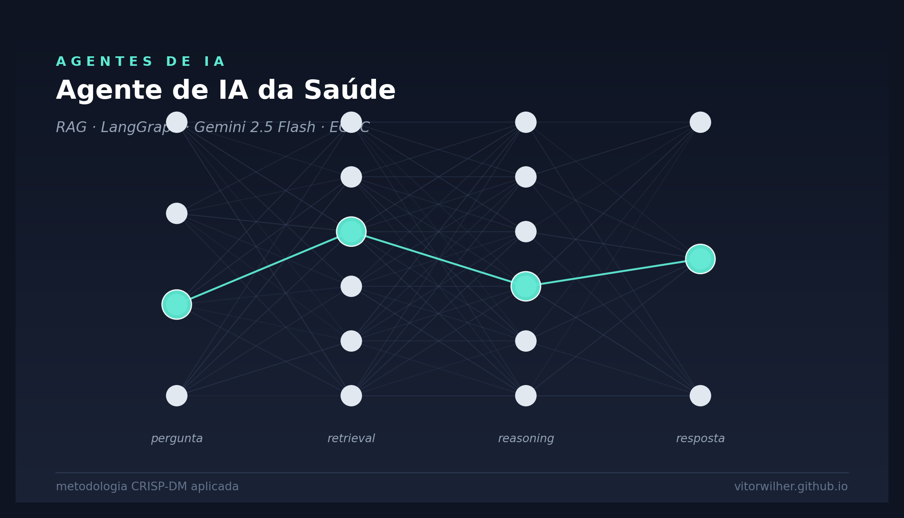

{width=100%}

## Visão Geral

Este projeto implementa, seguindo a metodologia **CRISP-DM** (*Cross-Industry Standard Process for Data Mining*), um **agente de IA conversacional** que responde perguntas de profissionais de saúde com base em relatórios epidemiológicos do *European Centre for Disease Prevention and Control* (ECDC) de 2021 sobre **Zika, Sífilis e Tuberculose**.

As seis fases do CRISP-DM foram adaptadas para um sistema de **IA generativa com RAG e agente ReAct**: a "modelagem" aqui é a composição agente + retriever + LLM com *prompt engineering* anti-alucinação; a "avaliação" é validação de precisão factual contra os PDFs de origem; o "deployment" é publicação em ambiente PaaS gerenciado.

::: {.callout-tip}
## Aplicação no ar

Disponível em <https://analisemacro.shinyapps.io/agente_ia_saude_poc/> — código-fonte em <https://github.com/vitorwilher/agente_ia_saude>.
:::

---

## 1. Entendimento do Negócio (*Business Understanding*)

### 1.1 Problema

Profissionais de saúde — principalmente médicos — precisam consultar dados epidemiológicos oficiais (incidência, taxas, faixas etárias, coinfecções, recomendações) com agilidade, mas os relatórios da ECDC são longos, em inglês e densos em tabelas. A leitura manual é lenta e propensa a erro de transcrição.

### 1.2 Objetivo

Construir um **assistente conversacional** que:

1. Aceita perguntas em linguagem natural (PT/EN);
2. Retorna respostas **factuais e ancoradas** nos relatórios;
3. **Recusa** responder quando a informação não estiver nas fontes;
4. Mantém **memória de conversa** para perguntas de *follow-up*.

### 1.3 Critérios de sucesso

| Critério | Meta |
|---|---|
| Precisão factual | Números citados conferem com o PDF de origem |
| Anti-alucinação | Recusa explícita quando o contexto não cobre a pergunta |
| Idioma | Resposta no idioma da pergunta |
| Latência | Resposta em menos de 10s no *free tier* |
| Custo operacional | US$ 0 (free tier do Gemini) |

### 1.4 Restrições identificadas

- **API**: *free tier* do Google Gemini → limites de RPM e modelos disponíveis.
- **Hospedagem**: shinyapps.io *Free* → limite de horas-instância e ausência de gestão de variáveis de ambiente via painel.
- **Conhecimento fechado**: o agente *não* deve responder com conhecimento genérico do LLM, apenas a partir dos PDFs.

---

## 2. Entendimento dos Dados (*Data Understanding*)

### 2.1 Fontes

Três relatórios anuais da ECDC publicados em 2021, totalizando **22 páginas**:

| Documento | Páginas | Tema |
|---|---:|---|
| *Zika virus disease — annual epidemiological report 2021* | ~7 | Zika |
| *Syphilis — annual epidemiological report 2021* | ~10 | Sífilis |
| *Tuberculosis — annual epidemiological report 2021* | ~5 | Tuberculose |
| **Total** | **22** | |

### 2.2 Características relevantes

- Texto estruturado em seções (epidemiologia, idade/gênero, transmissão, recomendações);
- Tabelas e quadros com números absolutos e taxas por 100.000 habitantes;
- Idioma: inglês;
- Domínio fechado: ano-base 2021, escopo geográfico UE/EEE.

::: {.callout-tip}
## *Insight* de *Data Understanding*

Por serem **relatórios oficiais** com estrutura padronizada (mesmo *template* ECDC), os PDFs se beneficiam de *chunking* baseado em separadores naturais (parágrafos, seções) — daí a escolha do `RecursiveCharacterTextSplitter` à frente.
:::

---

## 3. Preparação dos Dados (*Data Preparation*)

### 3.1 *Pipeline* de indexação

Implementado em [`src/index.py`](https://github.com/vitorwilher/agente_ia_saude/blob/main/src/index.py), executado **uma única vez** (e refeito apenas quando os PDFs mudam):

```python
loader = DirectoryLoader(
    path=database_dir, glob="*.pdf", loader_cls=PyPDFLoader
)
documents = loader.load()  # 22 páginas

splitter = RecursiveCharacterTextSplitter(
    chunk_size=1500,
    chunk_overlap=200,
)
chunks = splitter.split_documents(documents)  # 52 chunks

Chroma.from_documents(
    documents=chunks,
    embedding=get_embeddings(),
    collection_name="health_reports",
    persist_directory="chroma_db",
)
```

### 3.2 Decisões de preparação

| Hiperparâmetro | Valor | Justificativa |
|---|---:|---|
| `chunk_size` | 1500 | Captura parágrafo inteiro sem perder precisão de *retrieval* |
| `chunk_overlap` | 200 | Evita perder contexto em fronteiras de *chunk* |
| `embedding_model` | `gemini-embedding-001` | Modelo estável atual do Google (3072 dimensões) |
| Vetor *store* | Chroma persistente | Local, sem custo, ideal para POC |

::: {.callout-warning}
## Migração forçada de modelo

O modelo originalmente escolhido — `text-embedding-004` — foi **descontinuado pelo Google** durante a evolução do projeto. Migrou-se para `gemini-embedding-001`, que produz *embeddings* com 3072 dimensões (vs 768 antigos), aumentando o tamanho do índice em ~4×.
:::

### 3.3 Separação *build* × *runtime*

Decisão arquitetural importante: a indexação foi **separada do código de *runtime***.

- [`src/index.py`](https://github.com/vitorwilher/agente_ia_saude/blob/main/src/index.py) → executado *offline*, gera `chroma_db/`;
- [`src/rag.py`](https://github.com/vitorwilher/agente_ia_saude/blob/main/src/rag.py) → executado a cada *cold start*, **apenas carrega** o índice persistido.

Benefício: *cold start* em segundos em vez de minutos, e zero chamadas de *embedding* em produção.

---

## 4. Modelagem (*Modeling*)

### 4.1 Arquitetura: Agente ReAct + RAG

```{mermaid}
flowchart TB
  U([Usuário])
  UI[Shiny Chat UI]
  AG{LangGraph<br>ReAct Agent<br>gemini-2.5-flash}
  T[Tool:<br>search_health_documents]
  R[Retriever MMR<br>k=7]
  VS[(Chroma<br>chroma_db/)]
  MEM[(MemorySaver<br>thread_id)]

  U <--> UI
  UI <--> AG
  AG <-->|decide se busca| T
  T --> R
  R --> VS
  AG <--> MEM
```

### 4.2 Por que um agente, e não RAG puro?

Em um RAG clássico, **toda** pergunta dispara *retrieval* + LLM. Isso é desnecessário para saudações ("oi"), perguntas fora de escopo ou perguntas que o agente já respondeu antes na conversa.

O **agente ReAct** decide dinamicamente:

- *"Quantos casos de Zika em 2021?"* → chama a *tool*, busca, responde.
- *"Bom dia!"* → responde direto, sem busca.
- *"E nas mulheres?"* (*follow-up*) → reformula a *query* da *tool* com contexto da conversa.

### 4.3 Hiperparâmetros do LLM

| Parâmetro | Valor |
|---|---:|
| Modelo | `gemini-2.5-flash` |
| `temperature` | 0 |
| `top_p` | 0.9 |
| `top_k` | 40 |
| `max_output_tokens` | 5000 |

`temperature = 0` é deliberada: queremos respostas **determinísticas e factuais**, não criativas.

### 4.4 *System prompt* (anti-alucinação)

Trecho do [`configs.json`](https://github.com/vitorwilher/agente_ia_saude/blob/main/configs.json):

> *"Você tem acesso a uma ferramenta `search_health_documents`. Use-a sempre que a pergunta exigir dados factuais. **Nunca invente dados.** Se o contexto recuperado não cobrir a pergunta, diga que não sabe. Cite números exatos. Responda no idioma da pergunta."*

### 4.5 Memória de conversa

`MemorySaver` do LangGraph persiste o histórico **por `thread_id`**. No app Shiny, o `thread_id = session.id`, garantindo que cada usuário tem sua própria conversa isolada.

---

## 5. Avaliação (*Evaluation*)

### 5.1 Validação *end-to-end*

Teste de fumaça com pergunta canônica do PDF de Zika:

> **Pergunta:** *"Quantos casos de Zika foram registrados na União Europeia em 2021?"*
>
> **Resposta:** *"Em 2021, foram registrados 7 casos de doença do vírus Zika em países da União Europeia/Espaço Econômico Europeu (UE/EEE). Os casos foram notificados pela Espanha (n=4), Alemanha (n=2) e Luxemburgo (n=1)."*

Validação: confere com o PDF original (página 1, tabela *"Number of cases by reporting country"*).

### 5.2 Critérios qualitativos atingidos

- ✅ Precisão numérica
- ✅ Granularidade preservada (*breakdown* por país)
- ✅ Idioma da pergunta (PT)
- ✅ Sem alucinação
- ✅ Latência menor que 5s em chamada quente

### 5.3 Limitações conhecidas

- Não cita explicitamente *qual PDF + página* abaixo da resposta (o metadado existe, só não é exposto no Shiny);
- Sem avaliação automatizada (*golden set* de Q&A);
- Sem observabilidade de *runtime* (latência, taxa de uso da *tool*, etc.).

---

## 6. *Deployment*

### 6.1 *Stack* de produção

| Camada | Tecnologia |
|---|---|
| UI | [Shiny for Python](https://shiny.posit.co/py/) (`shiny.express`) |
| Orquestração de agente | [LangGraph](https://langchain-ai.github.io/langgraph/) (`create_react_agent`) |
| LLM | Google Gemini API (`gemini-2.5-flash`) |
| Vetor *DB* | Chroma (persistência local) |
| Hospedagem | shinyapps.io |
| *Deploy* | `rsconnect-python` |

### 6.2 Comando de *deploy*

```bash
rsconnect deploy shiny . \
  -n analisemacro \
  --entrypoint src/app \
  --exclude '.DS_Store' \
  --exclude '__pycache__' \
  --exclude 'rsconnect-python' \
  --exclude '.git'
```

::: {.callout-important}
## Lições aprendidas no *deploy*

1. **Para shinyapps.io use `-n <nickname>`**, não `--server` ou `--account` sozinhos — falham silenciosamente.
2. **Variáveis de ambiente** (ex: `GOOGLE_API_KEY`) só são gerenciáveis via painel em planos pagos. No *Free*, a alternativa é incluir o `.env` no *bundle*.
3. **`gemini-2.0-flash` saiu do *free tier*** — atualmente é necessário usar `gemini-2.5-flash` ou `gemini-2.5-flash-lite`.
4. **`chroma_db/` ultrapassa o limite de 100MB do GitHub** — *gitignored*; quem clonar precisa rodar `python src/index.py` localmente.
:::

### 6.3 Ciclo de manutenção

```{mermaid}
flowchart LR
  A[PDFs novos<br>ou atualizados] --> B[python src/index.py --force]
  B --> C[Teste local<br>shiny run src/app.py]
  C --> D[git commit<br>+ git push]
  D --> E[rsconnect deploy]
  E --> F([Produção])
```

---

## Trabalhos futuros

- **Mostrar fontes** abaixo de cada resposta (PDF + página);
- **Avaliação automatizada**: *golden set* de Q&A com `ragas` ou `langsmith`;
- **Observabilidade**: integrar com LangSmith / Phoenix para rastrear latência, taxa de uso da *tool*, qualidade das respostas;
- **Expandir base**: incluir mais relatórios da ECDC e de outras agências (CDC, OMS);
- *Caching* de respostas para perguntas frequentes.

---

## Referências

- ECDC. *Annual Epidemiological Reports 2021*. <https://www.ecdc.europa.eu>
- Wirth, R.; Hipp, J. (2000). *CRISP-DM: Towards a Standard Process Model for Data Mining*.
- LangChain. *LangGraph ReAct Agent*. <https://langchain-ai.github.io/langgraph/>
- Posit. *Shiny for Python*. <https://shiny.posit.co/py/>
