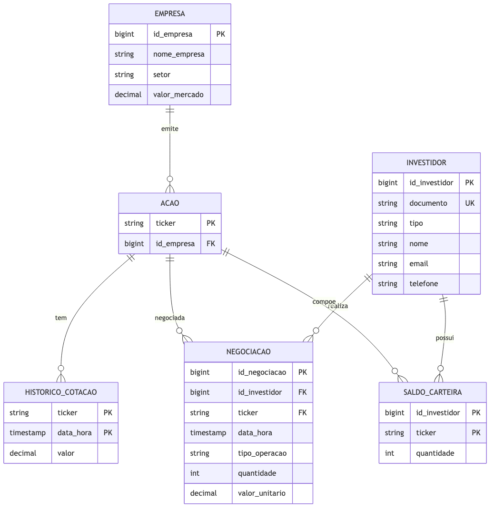

{width=100%}

## Visão Geral

Este projeto percorre as três camadas clássicas da **modelagem de dados** — conceitual, lógico e físico — para um sistema de **negociação em bolsa de valores** operado por uma corretora. Partindo de um enunciado em linguagem natural, o trabalho formaliza o domínio em um **modelo entidade-relacionamento (ER)**, traduz esse ER para um **esquema relacional** normalizado e o implementa como um **schema PostgreSQL** completo, com DDL, massa de teste (DML) e uma bateria de consultas de validação (DQL).

Cada fase é organizada segundo a metodologia **CRISP-DM** (*Cross-Industry Standard Process for Data Mining*), aqui adaptada de um contexto de *data mining* para um de **engenharia de dados / modelagem de banco de dados**: o "entendimento do negócio" vira o levantamento de requisitos, a "modelagem" vira o desenho conceitual e lógico, e a "implantação" vira o `CREATE TABLE` no SGBD-alvo. O artefato final é um conjunto de scripts SQL idempotentes e reprodutíveis, mais a documentação textual que os sustenta.

::: {.callout-tip}
## Tese central

Um enunciado ambíguo só vira um banco confiável quando cada decisão de modelagem é **explicitada e justificada**: separar Empresa de Ação (para acomodar PETR3/PETR4), usar PK *surrogate* onde a chave natural é instável (CPF vs. CNPJ), e materializar o **Saldo de Carteira** por *trigger* em vez de recalculá-lo na aplicação são escolhas que transformam requisitos vagos em integridade garantida pelo próprio SGBD.
:::

---

## Motivação

Este projeto nasce como atividade avaliativa da disciplina **Transformando Dados em Percepção (TDP)** (Prof. Anderson Nascimento), promovida a projeto de portfólio próprio. A proposta é demonstrar, de ponta a ponta, o ofício de modelar dados: sair de um texto de requisitos e chegar a um banco que **não permite** estados inconsistentes.

O domínio escolhido — uma corretora que gerencia investidores, ações e negociações — é rico o suficiente para exercitar todos os construtos centrais da modelagem relacional: entidades fortes, entidade associativa (N:M com atributos), entidade fraca (PK composta), chaves naturais vs. *surrogate*, e regras de negócio que só se resolvem com *trigger*.

O projeto responde a perguntas como:

- Como estruturar o relacionamento **N:M** entre investidores e ações, dado que um investidor negocia várias ações e uma ação é negociada por vários investidores?
- Empresa e Ação são o mesmo conceito ou entidades distintas? (Uma mesma empresa emite PETR3 ON e PETR4 PN.)
- Como manter o **Saldo de Carteira** sempre coerente com as negociações realizadas, sem depender da aplicação cliente?
- Como um histórico de cotações modelado como **série temporal** habilita análises retrospectivas de patrimônio?

---

## Metodologia — CRISP-DM

O projeto foi estruturado seguindo o processo **CRISP-DM** (*Cross-Industry Standard Process for Data Mining*), aqui adaptado ao contexto de **modelagem de dados relacional**: as fases mapeiam levantamento de requisitos → modelo conceitual → modelo lógico → modelo físico → validação por consultas → implantação do schema.

| Fase | Aplicação no Projeto |
|---|---|
| **1. Entendimento do Negócio** | Leitura do enunciado da corretora; identificação de investidores, ações, negociações, cotações e saldo de carteira; definição do critério de sucesso: um schema que sustenta as consultas de negócio e barra estados inválidos por construção. |
| **2. Entendimento dos Dados** | Levantamento dos atributos e domínios de cada entidade (CPF/CNPJ, ticker, enums de tipo e operação); análise das cardinalidades e das ambiguidades do enunciado (Empresa × Ação, natureza do saldo). |
| **3. Preparação dos Dados** | Modelo **conceitual (ER)**: seis entidades, seis relacionamentos, sete decisões de modelagem documentadas (D1–D7) e restrições de integridade a levar ao físico. Diagrama em Mermaid `erDiagram`. |
| **4. Modelagem** | Modelo **lógico (relacional)**: tradução ER → tabelas, com PKs *surrogate*/naturais, FKs, PKs compostas para entidade fraca e N:M, `CHECK` de domínio e índices propostos para otimização. |
| **5. Avaliação** | Modelo **físico + validação**: `ddl.sql` (DDL + *trigger* PL/pgSQL), `dml.sql` (massa de teste cobrindo todos os casos) e `dql.sql` (8 consultas que validam trigger, cardinalidades e decisões). Sintaxe validada com `pglast`, o parser oficial do Postgres (52 statements OK). |
| **6. Implantação** | Scripts SQL **idempotentes** (`DROP ... IF EXISTS` em ordem inversa de dependência) prontos para rodar em qualquer instância PostgreSQL 13+ via `psql -f`. |

---

## Arquitetura do Pipeline

```{mermaid}
flowchart LR
  A[Enunciado<br>requisitos em<br>linguagem natural] --> B[Modelo Conceitual<br>ER · 6 entidades<br>6 relacionamentos]
  B --> C[Modelo Lógico<br>esquema relacional<br>PK/FK · CHECK · índices]
  C --> D[Modelo Físico<br>DDL PostgreSQL<br>+ trigger PL/pgSQL]
  D --> E[Validação<br>DML massa de teste<br>+ 8 consultas DQL]
  E --> F[Schema implantado<br>psql -f · idempotente]
```

---

## 1. Entendimento do Negócio

Uma corretora quer um sistema para gerenciar **Investidores**, **Ações** e suas **Negociações** na bolsa. Os requisitos explícitos do enunciado:

- **Investidor** identificado por CPF *ou* CNPJ, com nome, tipo (pessoa física ou jurídica), e-mail e telefone.
- **Ação** pertencente a uma **Empresa** listada, identificada por seu *ticker*, com nome da empresa, setor e valor de mercado.
- **Negociações** (compra ou venda) registrando data/hora, tipo de operação, quantidade e valor unitário no momento da transação.
- **Histórico de Cotações** das ações — data, hora e valor — para permitir análise de séries temporais.
- **Saldo de Carteira** de cada investidor (posição atual), atualizado a partir das negociações, com suporte a análises retrospectivas via histórico de cotações.

**Critério de sucesso:** um schema que (i) sustenta todas as consultas de negócio (posição da carteira, patrimônio, extrato, volume, séries de cotação) e (ii) impede estados inconsistentes por construção — venda sem saldo, quantidade negativa, documento com tamanho incompatível com o tipo, ticker órfão de empresa.

---

## 2. Entendimento dos Dados

O domínio se decompõe em **seis entidades**, cujos atributos e domínios foram levantados a partir do enunciado:

| Entidade | Papel | Chave |
|---|---|---|
| **Investidor** | PF ou PJ que negocia ações | `id_investidor` (surrogate) + `documento` único |
| **Empresa** | Empresa listada que emite ações | `id_empresa` (surrogate) |
| **Ação** | Papel emitido, identificado pelo *ticker* | `ticker` (natural) |
| **Negociação** | Compra/venda de uma ação por um investidor | `id_negociacao` (surrogate) — entidade associativa |
| **Histórico de Cotação** | Snapshots de preço ao longo do tempo | `(ticker, data_hora)` — PK composta, entidade fraca |
| **Saldo de Carteira** | Posição atual por investidor × ação | `(id_investidor, ticker)` — PK composta |

Os domínios fechados foram identificados desde a análise: `Investidor.tipo ∈ {PF, PJ}` e `Negociacao.tipo_operacao ∈ {COMPRA, VENDA}`, ambos destinados a virar `CHECK IN (...)` no físico. Duas **ambiguidades** do enunciado exigiram decisão explícita: se Empresa e Ação são um único conceito (não são — ver D2) e se o Saldo de Carteira é uma *view* derivada ou uma tabela observável (é tabela materializada — ver D4).

---

## 3. Preparação dos Dados — Modelo Conceitual (ER)

O modelo conceitual formaliza as seis entidades e **seis relacionamentos**, todos `1:N` na notação *crow's foot*:

| # | Entidade A | Verbo | Entidade B | Cardinalidade |
|---|---|---|---|---|
| R1 | Empresa | **emite** | Ação | (1,1) — (1,N) |
| R2 | Investidor | **realiza** | Negociação | (1,N) — (1,1) |
| R3 | Ação | **é objeto de** | Negociação | (1,N) — (1,1) |
| R4 | Ação | **tem** | Histórico de Cotação | (1,1) — (0,N) |
| R5 | Investidor | **possui** | Saldo de Carteira | (1,1) — (0,N) |
| R6 | Ação | **compõe** | Saldo de Carteira | (1,1) — (0,N) |

**Negociação** materializa o relacionamento N:M entre Investidor e Ação como **entidade associativa** com atributos próprios (data/hora, tipo, quantidade, valor). **Histórico de Cotação** é **entidade fraca** com PK composta `(ticker, data_hora)`: no máximo uma cotação por ação por instante.

As sete **decisões de modelagem** documentadas no conceitual:

| ID | Decisão | Justificativa |
|---|---|---|
| **D1** | Investidor com PK *surrogate* + `documento` único | Evita PK de tamanho variável (CPF 11 dígitos vs. CNPJ 14) e simplifica FKs. |
| **D2** | Empresa e Ação como entidades distintas (1:N) | Uma empresa emite várias classes de ação (PETR3 ON, PETR4 PN). |
| **D3** | `valor_mercado` como atributo simples (não histórico) | Enunciado pede snapshot; histórico de preço fica na Cotação. |
| **D4** | Saldo de Carteira como **tabela materializada** via *trigger* | Enunciado quer saldo "atualizado a partir das negociações" — trigger garante consistência sem responsabilizar a aplicação. |
| **D5** | `ticker` como PK natural da Ação | Curto, único, imutável — evita *join* extra em Negociação e Cotação. |
| **D6** | `tipo` e `tipo_operacao` como enums via `CHECK` | Domínios fechados evitam inconsistência por digitação livre. |
| **D7** | `quantidade` como inteiro | Ações brasileiras são negociadas em unidades inteiras. |

---

## 4. Modelagem — Modelo Lógico (Relacional)

A tradução ER → relacional produz seis tabelas. Cada relacionamento 1:N vira uma FK no lado N; as PKs compostas materializam a entidade fraca e a associação:

```
Investidor (id_investidor PK, documento UNIQUE, tipo CHECK IN (PF,PJ),
            nome, email, telefone)

Empresa    (id_empresa PK, nome_empresa, setor, valor_mercado CHECK >= 0)

Acao       (ticker PK, id_empresa FK → Empresa)

Negociacao (id_negociacao PK,
            id_investidor FK → Investidor, ticker FK → Acao,
            data_hora, tipo_operacao CHECK IN (COMPRA,VENDA),
            quantidade CHECK > 0, valor_unitario CHECK > 0)

HistoricoCotacao (ticker PK/FK → Acao, data_hora PK, valor CHECK > 0)

SaldoCarteira    (id_investidor PK/FK → Investidor, ticker PK/FK → Acao,
                  quantidade CHECK >= 0)
```

Além dos índices implícitos das PKs e da `UNIQUE` de `documento`, o lógico propõe índices de otimização para os padrões de acesso previstos: `idx_negociacao_investidor` (extrato/posição), `idx_negociacao_ticker_data` (histórico por ação), `idx_cotacao_data` (última cotação até X) e `idx_acao_empresa` (join Empresa × Ação). Os domínios fechados ficam como `CHECK IN (...)` em vez de `ENUM` nativo, por portabilidade.

---

## 5. Avaliação — Modelo Físico e Validação

O físico implementa o esquema em **PostgreSQL 13+** com três scripts.

### 5.1 DDL — schema + trigger

`ddl.sql` cria as seis tabelas com todas as constraints (PK, FK, `UNIQUE`, `CHECK`), incluindo a validação cruzada de que o `documento` tem 11 dígitos quando `tipo = 'PF'` e 14 quando `'PJ'`. As PKs *surrogate* usam `BIGINT GENERATED ALWAYS AS IDENTITY`. O coração do físico é a **materialização do Saldo de Carteira** (decisão D4) via *trigger* `AFTER INSERT` em `Negociacao`:

```sql
CREATE OR REPLACE FUNCTION fn_atualiza_saldo_carteira()
RETURNS TRIGGER AS $$
BEGIN
    IF NEW.tipo_operacao = 'COMPRA' THEN
        INSERT INTO SaldoCarteira (id_investidor, ticker, quantidade)
        VALUES (NEW.id_investidor, NEW.ticker, NEW.quantidade)
        ON CONFLICT (id_investidor, ticker)
        DO UPDATE SET quantidade = SaldoCarteira.quantidade + EXCLUDED.quantidade;
    ELSIF NEW.tipo_operacao = 'VENDA' THEN
        -- valida saldo suficiente; RAISE EXCEPTION se venda a descoberto
        ...
    END IF;
    RETURN NEW;
END;
$$ LANGUAGE plpgsql;
```

Uma **COMPRA** soma ao saldo (via `UPSERT`); uma **VENDA** subtrai, mas levanta `RAISE EXCEPTION` se o investidor não tiver ações suficientes — o banco **recusa** a venda a descoberto por construção.

### 5.2 DML — massa de teste

`dml.sql` popula o banco cobrindo todos os casos: **4 investidores** (2 PF por CPF, 2 PJ por CNPJ), **3 empresas / 5 ações** (Petrobras com PETR3 e PETR4, Vale com VALE3, Itaú com ITUB3 e ITUB4), **12 negociações** (compras e vendas, datadas 20–24/abr/2026) e **16 pontos de cotação** para gerar séries temporais. O `SaldoCarteira` **não** recebe `INSERT` manual — é o *trigger* que o popula.

### 5.3 DQL — 8 consultas de validação

`dql.sql` exercita e valida o modelo:

| # | Consulta | O que valida |
|---|---|---|
| Q1 | Posição atual da carteira por investidor | O *trigger* (saldo = compras − vendas). |
| Q2 | Patrimônio atual (carteira × última cotação, `DISTINCT ON`) | Join carteira × série de cotação. |
| Q3 | Extrato de negociações de PETR4 por data | Índice `ticker, data_hora`. |
| Q4 | Top investidores por volume financeiro | Agregação sobre Negociação. |
| Q5 | Série temporal de cotação com variação abs./% (`LAG`) | Modelagem de cotação como série temporal. |
| Q6 | Volume diário negociado por ação | Agregação por dia e ticker. |
| Q7 | Empresas com mais de uma ação listada | A decisão **D2** (Empresa 1:N Ação). |
| Q8 | Patrimônio retrospectivo em data D (carteira × cotação histórica) | Análise retrospectiva pedida no enunciado. |

A sintaxe de todos os scripts foi validada com **`pglast`** (parser oficial do PostgreSQL): 52 statements sem erro.

---

## 6. Implantação

Os scripts são **idempotentes**: `ddl.sql` começa com `DROP ... IF EXISTS` em ordem inversa de dependência (trigger → função → tabelas), então pode ser reexecutado sem erro. A implantação em qualquer instância PostgreSQL 13+ é direta:

```bash
psql -d minha_base -f fisico/ddl.sql   # schema + trigger
psql -d minha_base -f fisico/dml.sql   # massa de teste (trigger popula o saldo)
psql -d minha_base -f fisico/dql.sql   # 8 consultas de validação
```

---

## Estrutura do Projeto

```
Modelagem_Corretora_Bolsa_Valores/
├── enunciado.md                  # transcrição do enunciado (Google Doc)
├── README.md                     # visão geral e roadmap
│
├── conceitual/
│   ├── modelo.md                 # especificação textual do modelo conceitual
│   ├── diagrama_er.mmd           # diagrama ER (Mermaid erDiagram, editável)
│   └── diagrama_er.png           # render do diagrama ER
│
├── logico/
│   └── modelo.md                 # esquema relacional textual (ER → tabelas)
│
├── fisico/
│   ├── ddl.sql                   # CREATE TABLE, constraints, trigger PL/pgSQL
│   ├── dml.sql                   # INSERTs cobrindo todas as entidades
│   └── dql.sql                   # 8 consultas que validam o modelo
│
└── portfolio/                    # divulgação CRISP-DM
    ├── modelagem-corretora-bolsa-valores.qmd   # ESTE arquivo
    ├── modelagem-corretora-bolsa-valores_capa.png
    └── _TEMPLATE.md
```

---

## Tecnologias

| Camada | Stack |
|---|---|
| **SGBD-alvo** | PostgreSQL 13+ |
| **DDL / DML / DQL** | SQL padrão + extensões PostgreSQL |
| **Lógica de negócio** | PL/pgSQL (*trigger* `AFTER INSERT`) |
| **Recursos SQL** | `GENERATED ALWAYS AS IDENTITY`, `ON CONFLICT` (UPSERT), CTE, `DISTINCT ON`, *window functions* (`LAG`), `STRING_AGG` |
| **Modelagem conceitual** | Mermaid `erDiagram` (+ especificação para BrModelo) |
| **Validação de sintaxe** | `pglast` (parser oficial do Postgres) |
| **Documentação** | Markdown + Quarto |

---

## Como Executar Localmente

```bash
git clone <url-do-repo>
cd Modelagem_Corretora_Bolsa_Valores

# Em uma instância PostgreSQL 13+ com uma base recém-criada:
createdb corretora

psql -d corretora -f fisico/ddl.sql   # schema + trigger
psql -d corretora -f fisico/dml.sql   # massa de teste
psql -d corretora -f fisico/dql.sql   # consultas de validação
```

O `ddl.sql` é idempotente — pode ser reexecutado para recriar o schema do zero.

Para regenerar o diagrama ER a partir da fonte Mermaid:

```bash
npx -p @mermaid-js/mermaid-cli@latest mmdc \
    -i conceitual/diagrama_er.mmd -o conceitual/diagrama_er.png -b white -w 1600
```

---

## Próximos Passos

- Construir o modelo conceitual e o lógico no **BrModelo** (`.brM3` + `.png`), conforme pede a entrega acadêmica.
- Executar um *smoke test* dos scripts `.sql` em uma instância PostgreSQL real (hoje só validados por parser).
- Consolidar conceitual + lógico em um documento Word para submissão via Classroom.
- Estender o modelo: proventos (dividendos/JCP), custódia por conta, taxas de corretagem e um livro de ofertas (*order book*).

---

## Referências

- ELMASRI, Ramez; NAVATHE, Shamkant. *Sistemas de Banco de Dados*. 7ª ed. São Paulo: Pearson, 2018.
- DAMAS, Luís. *SQL — Structured Query Language*. 6ª ed. Rio de Janeiro: LTC, 2007.
- The PostgreSQL Global Development Group. *PostgreSQL 13 Documentation* — *Triggers*, *CREATE TABLE*, *INSERT ... ON CONFLICT*, *Window Functions*.
- Ferramenta de modelagem **BrModelo** — http://www.sis4.com/brModelo/
- `pglast` — *PostgreSQL Languages AST and statements prettifier* — https://github.com/lelit/pglast
- Wirth, R.; Hipp, J. (2000). *CRISP-DM: Towards a Standard Process Model for Data Mining*.
