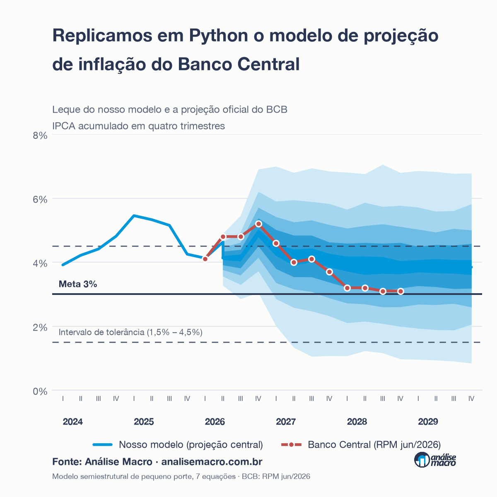

{width=100%}

::: {.callout-tip}
## Experimente agora

O servidor MCP está no ar, é **público e gratuito**. Cole esta URL como conector
personalizado no Claude (Configurações → Connectors) e peça *"projete a inflação
com a Selic a 12,5% e o câmbio a R$ 5,60"*:

```
https://mpp-mcp.analisemacro.workers.dev/mcp
```

O passo a passo está na [seção final desta página](#usando-o-mcp).
:::

## O problema

O Banco Central projeta a inflação com um conjunto de modelos. O mais transparente
deles é o **Modelo de Pequeno Porte** (MPP): um modelo semiestrutural
deliberadamente parcimonioso, cuja função é menos prever com máxima acurácia do
que organizar de forma clara o raciocínio condicional que sustenta a decisão de
política monetária.

O BCB publica a estrutura das equações nos boxes dos Relatórios de Inflação e,
desde 2020, as tabelas de parâmetros estimados. Mas **não publica o código nem a
base de dados**. Para quem quer usar o modelo — e não apenas ler suas projeções —
isso é uma parede.

Este projeto atravessa essa parede: reconstrói o modelo em Python, mede o quão
perto se chega das projeções oficiais, e expõe o motor como uma ferramenta que
qualquer pessoa pode usar conversando com uma IA.

---

## O modelo

Sete equações estimadas e treze identidades contábeis, em frequência trimestral.

| Bloco | Papel |
|---|---|
| **Curva IS** | Hiato do produto responde ao juro real |
| **Curva de Phillips** | Inflação de preços livres |
| **Expectativas** | Formação das expectativas de inflação |
| **Regra de Taylor** | Selic reage ao desvio das expectativas |
| **Paridade de juros** | Câmbio reage ao diferencial de juros |
| **Preços administrados** | Repasse do petróleo em reais |
| **Sazonalidade** | Dessazonalização dos preços livres |

O que distingue esta versão: **Selic, câmbio e preços administrados são
endógenos**. Isso significa que o modelo os projeta sozinho, em vez de recebê-los
como hipótese — e cria um bloco simultâneo dentro do trimestre, em que as
expectativas dependem do hiato, o hiato do juro real, o juro real da Selic, a
Selic das expectativas, e o câmbio do diferencial de juros.

A consequência econômica é direta: um aperto monetário passa a **apreciar o
câmbio**, e a apreciação realimenta a inflação. O canal cambial de transmissão,
ausente quando o câmbio é exógeno, torna-se operante.

A base é recoletada das fontes primárias — Banco Central, IBGE, FRED, NOAA —, o
que torna o exercício **atualizável**: o modelo roda com os dados de hoje.

---

## Os resultados

### Validação econômica

O teste mais exigente disponível é comparar os multiplicadores do modelo com os
que o Banco Central publica:

| Choque | Modelo | BCB (jun/2024) |
|---|---|---|
| Selic +1 p.p. por 4 trimestres | **−0,37 p.p.** | −0,27 p.p. |
| Depreciação cambial de 10% | **+0,79 p.p.** | +0,96 p.p. |
| Coeficiente de reação da Taylor | **1,66** | 1,30 – 2,03 |

O multiplicador de juros **cerca** a estimativa oficial, com o perfil temporal
correto — resposta negativa, gradual, com pico no quinto trimestre. O coeficiente
da regra de Taylor cai dentro da faixa publicada pelo BCB.

### Comparação com as projeções oficiais

Confrontando com o **Relatório de Política Monetária de junho de 2026**:

| Métrica | Valor |
|---|---|
| Erro absoluto médio (12 trimestres) | **0,47 p.p.** |
| Diferença no primeiro trimestre | **0,03 p.p.** |
| Viés médio | +0,21 p.p. |

E o resultado que mais importa: **a projeção oficial do Banco Central situa-se
dentro do leque estocástico do nosso modelo em todos os onze trimestres
comparados** — em sete deles, dentro da banda de 50% ou mais estreita. É o que a
figura de capa mostra: a linha vermelha atravessa o interior do leque azul do
começo ao fim.

As duas trajetórias não são, portanto, estatisticamente incompatíveis — apesar de
os modelos subjacentes serem estruturalmente distintos.

### As diferenças, que são o mais interessante

A divergência se concentra no horizonte distante e **tem causas identificáveis**:
o modelo agregado não separa a inflação por setores, como faz o BCB; os preços
administrados oficiais vêm de modelos específicos item a item; e o cenário do BCB
supõe um fechamento do hiato do produto que o nosso não reproduz.

Nenhuma dessas diferenças é ruído. Todas apontam para componentes ausentes e
nomeáveis — o que é, do ponto de vista de aprendizado, mais valioso que o acerto.

---

## A distância honesta

Cabe uma ressalva, porque a tentação de apresentar o resultado como "a projeção do
Banco Central" é real — e seria incorreto.

**Este não é o modelo vigente do BCB.** Em setembro de 2020 houve uma ruptura
metodológica: o Banco Central passou a estimar o hiato do produto e o juro real
neutro como **variáveis latentes**, com estimação bayesiana. O modelo aqui
replicado pertence à linhagem **anterior** a essa ruptura.

Não estamos a alguns ajustes do modelo vigente — estamos do outro lado de uma
mudança de paradigma econométrico. As projeções produzidas aqui **não são** as do
Banco Central e não devem ser apresentadas como tais.

Dito isso, a aderência medida acima mostra que a linhagem replicada ainda captura
bem o essencial do mecanismo de transmissão.

---

## Usando o MCP {#usando-o-mcp}

O motor do modelo está exposto como **servidor MCP** — o padrão aberto que permite
a um assistente de IA chamar ferramentas externas. Na prática: você conversa com o
Claude, informa as premissas, e ele devolve a projeção e o **gráfico pronto** para
colar no relatório.

::: {.callout-note}
## Por que isso importa

Sem MCP, se você pedir uma projeção de inflação ao Claude, ele responde com o que
"lembra" — e pode inventar um número plausível. Com ele, o Claude **roda o modelo
de verdade** e devolve o resultado.
:::

### Conectar

No Claude, vá em **Configurações → Connectors → Adicionar conector personalizado**
e cole:

```
https://mpp-mcp.analisemacro.workers.dev/mcp
```

Se aparecerem quatro ferramentas com o prefixo `mpp_`, está funcionando. Não
precisa de senha, cadastro nem instalação. O mesmo endereço funciona em qualquer
cliente que fale MCP — Cursor, Codex, VS Code.

### O que dá para pedir

Comece pelo simples, para ver o cenário de referência:

> *"O que o modelo de pequeno porte projeta para a inflação?"*

Depois informe suas próprias hipóteses — que é o ponto do exercício:

> *"Projete a inflação supondo a Selic a 12,5% e o câmbio a R$ 5,60."*

> *"E se o petróleo subir para US$ 110 e o risco-país for a 220 pontos?"*

> *"Faça a projeção com a Selic caindo gradualmente: 14, 13,5, 13, 12,5 e 12%."*

Note a última: quando você dá uma **lista**, cada valor vale para um trimestre. Um
número único vale para todo o horizonte.

Para o gráfico:

> *"Faça um gráfico de leque dessa projeção."*

E para comparar cenários:

> *"Compare um cenário com a Selic a 14% contra outro a 11%."*

### As premissas aceitas

| Premissa | Unidade |
|---|---|
| Selic | % ao ano |
| Câmbio | R$/US$ |
| Petróleo Brent | US$/barril |
| Inflação americana | % no trimestre |
| Juro básico americano | % ao ano |
| Risco-país (CDS 5 anos) | pontos-base |
| Juro real neutro | % ao ano |
| Âncora de inflação de longo prazo | % |
| Pressão em cadeias globais | desvios-padrão |
| Oceanic Niño Index | °C |

Você não precisa decorar os nomes — basta descrever em português. O que não for
informado segue o cenário de referência.

### O detalhe que muda a interpretação

Este é o ponto mais importante para quem for usar.

**Selic e câmbio são variáveis endógenas.** Se você não informar nada, o modelo as
**projeta sozinho** e elas aparecem como *resultado*. Quando você **informa** uma
trajetória de Selic, está **suspendendo** a regra de Taylor: o que sai não é mais
"o que o modelo prevê", e sim "o que aconteceria com a inflação **se** a Selic
seguisse esse caminho".

A distinção importa na hora de comunicar. Um exemplo concreto: se você impuser uma
Selic mais baixa do que a regra estimada recomendaria, o modelo devolve inflação
mais alta e crescente — não porque esteja errado, mas porque você pediu exatamente
isso.

### Um roteiro de dez minutos

1. *"O que o modelo de pequeno porte projeta para a inflação?"*
2. *"Me explica esse modelo e suas limitações."*
3. *"Projete com a Selic a 12,5% e o câmbio a R$ 5,60."*
4. *"Faça um gráfico de leque dessa projeção."*
5. *"Compare esse cenário com um de Selic a 15%."*
6. *"Por que a inflação sobe quando a Selic cai nesse modelo?"*

A última pergunta é a mais interessante: o assistente consegue explicar o
mecanismo de transmissão — juro real menor, hiato mais aberto, pressão na curva de
Phillips — em vez de apenas repetir números.

---

## Em breve

A reconstrução completa — a arqueologia das equações, a recuperação da base, a
estimação e a validação, passo a passo — será material de um **curso novo**.

Se você trabalha com projeção macroeconômica e quer saber quando abrir,
[entre em contato](https://analisemacro.com.br).
