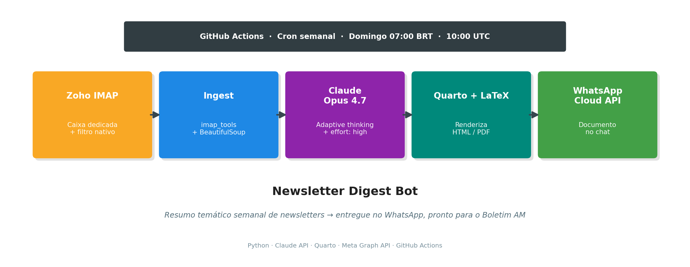

{width=100%}

## Visão Geral

Este projeto implementa, seguindo a metodologia **CRISP-DM** (*Cross-Industry Standard Process for Data Mining*), o pipeline construído para automatizar o resumo semanal de newsletters que alimenta a redação do **Boletim AM** (Análise Macro).

As seis fases do CRISP-DM foram adaptadas ao contexto deste projeto, que não é estritamente uma aplicação de *data mining*, mas um pipeline de **síntese informacional** com LLM. O mapeamento é direto: a "modelagem" aqui é *prompt engineering* e escolha de modelo generativo; a "avaliação" é validação qualitativa do resumo produzido; o "deployment" é o agendamento semanal em nuvem com entrega em múltiplos canais.

---

## 1. Entendimento do Negócio (*Business Understanding*)

### 1.1 Problema

Toda semana, o autor recebe newsletters de diferentes fontes sobre IA, dados, tecnologia e mercado financeiro. O tempo para ler todas manualmente antes de escrever o Boletim AM aos domingos é escasso, e informações relevantes são perdidas.

### 1.2 Objetivo de negócio

Produzir, **todo domingo às 7h (horário de Brasília)**, um resumo temático das newsletters recebidas na semana, entregue em dois canais:

- **PDF** arquivado localmente para consulta (versão final);
- **WhatsApp** para leitura rápida no celular, com o PDF anexo.

O resumo deve:

1. Agrupar conteúdos **organicamente por tema**, não por fonte;
2. Destacar **implicações para macroeconomia e mercados**, criando a ponte direta com o Boletim AM;
3. Usar tom editorial direto, sem floreio;
4. Citar a newsletter-origem ao final de cada ponto para rastreabilidade.

### 1.3 Critérios de sucesso

| Critério | Meta |
|---|---|
| Entrega automática | Domingo 07:00 BRT, sem intervenção humana |
| Cobertura | 100% das newsletters assinadas |
| Qualidade do resumo | Claude Opus 4.7 com *adaptive thinking* em `effort: high` |
| Formato final | PDF renderizado via Quarto + LaTeX |
| Custo operacional | < US$ 1/mês |

### 1.4 Restrições identificadas

- **Janela de 24h da Meta WhatsApp Cloud API**: mensagens *free-form* só são entregues se houver conversa ativa nos últimos 24h. Solução: usar *message template* pré-aprovado (em análise pela Meta no momento desta redação).
- **Segurança dois-admins do Business Portfolio**: impediu criar *System User Token* permanente. Solução: *User Access Token* de 60 dias, renovação manual bimestral.
- **Infraestrutura local dependente do Mac ligado**: resolvido migrando agendamento para **GitHub Actions** (execução na nuvem).

---

## 2. Entendimento dos Dados (*Data Understanding*)

### 2.1 Fontes

Newsletters assinadas em um e-mail dedicado do **Zoho Mail** (conjunto evolui com o tempo — exemplos já cobertos pelo pipeline):

| Newsletter | Remetente | Cadência | Temática |
|---|---|---|---|
| Data Hackers | `newsletter@mail.datahackers.com.br` | Semanal | IA e dados, Brasil |
| TechDrop | `newsletter@mail.techdrop.news` | Seg/Qua/Sex 6h | Tecnologia e negócios |
| MoneyDrop | `newsletter@mail.moneydrop.news` | Ter/Qui 10h | Mercado financeiro |
| AiDrop | `newsletter@mail.aidrop.news` | Quintas | Inteligência artificial |
| AI Whisper | `aiwhisperbr@mail.beehiiv.com` | Semanal | IA, curadoria Brasil |

> A conta Zoho serve exclusivamente como caixa de entrada dessas newsletters — separada do e-mail pessoal/profissional para evitar ruído e facilitar a extração programática.

### 2.2 Estrutura dos dados

- **Protocolo de acesso**: IMAP (`imap.zoho.com:993`, SSL), autenticação via *App Password*.
- **Pasta inspecionada**: `Newsletter`. O filtro nativo do Zoho (*Newsletters / Subscriptions / Automated email alerts*) roteia automaticamente novas assinaturas para essa pasta, sem exigir ajuste no código.
- **Formato**: MIME multipart. A maioria dos corpos vem em `text/html`; presença ocasional de `text/plain`.

### 2.3 Volumetria esperada

- ~4 a 10 e-mails por semana (variando com frequência de cada newsletter).
- Corpos típicos: 2.000 a 20.000 caracteres por mensagem após *stripping* de HTML.
- Janela deslizante: últimos 7 dias (parametrizável via `--dias`).

### 2.4 Qualidade

- **Sinal x ruído**: os e-mails trazem HTML pesado (tracking pixels, imagens, botões). Necessário extrair apenas o texto relevante.
- **Codificação**: UTF-8 consistente; sem problemas de encoding observados.
- **Duplicação**: cada mensagem tem UID único dentro da pasta `Newsletter`; não há necessidade de *dedup* explícito na arquitetura atual (fonte única).

---

## 3. Preparação dos Dados (*Data Preparation*)

### 3.1 Coleta via IMAP

Biblioteca utilizada: [`imap_tools`](https://github.com/ikvk/imap_tools) — API idiomática sobre `imaplib` com suporte a filtros declarativos (`AND(date_gte=...)`).

```python
with MailBox("imap.zoho.com", 993).login(user, password) as mailbox:
    mailbox.folder.set("Newsletter")
    for msg in mailbox.fetch(AND(date_gte=since), reverse=True, mark_seen=False):
        ...
```

Ponto relevante: **`mark_seen=False`** para não marcar as mensagens como lidas no Zoho — o usuário continua lendo a caixa normalmente.

### 3.2 Filtragem por pasta (delegada ao Zoho)

A triagem do que é ou não newsletter é delegada ao próprio Zoho, que possui um filtro nativo pré-configurado:

> *"Newsletters / Subscriptions / Automated email alerts → Move to folder: Newsletter"*

O script lê exclusivamente a pasta `Newsletter`. A consequência prática é que **novas assinaturas são capturadas automaticamente** — não é necessário editar código nem redeploy. A manutenção do conjunto de fontes passa a ser 100% no painel do Zoho (assinar/desassinar newsletter, ou mover manualmente um e-mail para dentro/fora da pasta).

Benefícios dessa arquitetura:

- **Zero acoplamento** entre o código Python e a lista de newsletters ativas;
- **Contrato claro**: tudo na pasta `Newsletter` entra no resumo da semana;
- **Fácil de estender**: assinar uma nova newsletter é um evento operacional, não um *deploy*.

### 3.3 Normalização HTML → texto

Biblioteca: `BeautifulSoup4`. Remoção explícita de `<script>` e `<style>` antes da extração:

```python
def html_to_text(html: str) -> str:
    soup = BeautifulSoup(html, "html.parser")
    for tag in soup(["script", "style"]):
        tag.decompose()
    return soup.get_text("\n", strip=True)
```

Cada corpo é truncado em **20.000 caracteres** (`MAX_BODY_CHARS`) para evitar estouro de tokens em casos anômalos.

### 3.4 Estrutura de entrada para o LLM

Itens coletados são concatenados em um único *user message* com separadores explícitos:

```
### Newsletter 1
- De: newsletter@mail.datahackers.com.br
- Assunto: 🧠 Você agora faz parte da Newsletter do Data Hackers!
- Data: 2026-04-23T...

<corpo em texto limpo>

---

### Newsletter 2
...
```

Essa estrutura ajuda o modelo a **atribuir corretamente as citações** no resumo final.

---

## 4. Modelagem

### 4.1 Escolha do modelo

**Claude Opus 4.7** (`claude-opus-4-7`) foi escolhido por:

- Qualidade editorial em pt-BR;
- *Adaptive thinking* nativo — modelo decide quanto raciocinar por tarefa;
- Janela de contexto de 1M tokens (folga para semanas com muito material);
- Custo compatível com uso semanal (~US$ 0,10 a 0,30 por execução).

### 4.2 Configurações

```python
client.messages.stream(
    model="claude-opus-4-7",
    max_tokens=8000,
    thinking={"type": "adaptive"},
    output_config={"effort": "high"},
    system=SYSTEM_PROMPT,
    messages=[{"role": "user", "content": build_user_message(items)}],
)
```

Streaming foi usado para evitar *timeout* HTTP em respostas longas (recomendação do SDK da Anthropic para `max_tokens` altos ou *input* longo).

### 4.3 Prompt engineering — o *system prompt*

Princípios do prompt:

1. **Persona explícita**: "assistente especializado em síntese para economista sênior que escreve o Boletim AM". Isso calibra registro e profundidade.
2. **Agrupamento orgânico** (não categorias fixas): o modelo detecta temas a partir do conteúdo semanal, refletindo o que a semana de fato trouxe.
3. **Citação obrigatória da fonte** ao final de cada bullet — rastreabilidade.
4. **Seção fixa de implicações macro**: força o *bridge* para o Boletim AM.
5. **Restrições de tom**: sem emoji, sem preâmbulo, sem jargão desnecessário.

Trecho-chave do prompt:

> *"Use títulos de nível 2 (##) para cada TEMA identificado organicamente a partir do conteúdo. Não force categorias pré-definidas. Ao final, adicione uma seção 'Implicações para macroeconomia e mercados' com 3 a 5 bullets conectando os temas da semana a possíveis impactos em política monetária, inflação, mercados financeiros, atividade econômica ou geopolítica."*

### 4.4 Formato de saída

O modelo retorna Markdown compatível com **Quarto**. O script concatena:

1. Frontmatter YAML (título, autor, data, configurações de HTML e PDF);
2. Corpo gerado pelo modelo;
3. Apêndice com lista de fontes (subject + remetente).

O arquivo final é gravado em `digests/resumo-YYYY-MM-DD.qmd`.

---

## 5. Avaliação

### 5.1 Testes locais (Mac)

Primeira execução com janela de 30 dias devolveu 4 newsletters — todas mensagens de boas-vindas (sem conteúdo editorial real). O modelo foi **honesto**: identificou a ausência de conteúdo substantivo e declarou isso explicitamente, em vez de alucinar síntese. Esse é um sinal positivo de calibração.

> Trecho do primeiro resumo: *"As quatro mensagens recebidas nesta semana são e-mails de boas-vindas e confirmação de assinatura, sem conteúdo editorial substantivo para resumir."*

### 5.2 Simplificação da arquitetura de filtragem

A versão inicial usava uma lista de *substrings* (`SENDER_PATTERNS`) para decidir quais e-mails eram newsletters. Esse desenho tinha dois problemas:

1. **Fragilidade**: erros sutis como `techdrops` (com `s`) vs. `techdrop.news` (sem `s`) silenciavam fontes inteiras;
2. **Acoplamento**: assinar uma newsletter nova exigia editar código, commitar e dar push.

Ao descobrir que o **Zoho tem um filtro nativo** que roteia automaticamente qualquer *Newsletter / Subscription / Automated alert* para a pasta `Newsletter`, a arquitetura foi simplificada: o script passou a ler apenas essa pasta, sem filtro de remetente. Assinar uma newsletter nova deixa de ser um evento de engenharia.

### 5.3 Teste end-to-end na CI

Workflow disparado manualmente (*workflow_dispatch*) concluiu em **2m 22s** com todas as etapas verdes:

1. Checkout → Setup Python → Setup Quarto+TinyTeX;
2. Instalação de dependências;
3. Fetch IMAP + síntese Claude + render PDF + envio WhatsApp;
4. Commit do digest de volta no repo.

### 5.4 Descoberta crítica: janela de 24h do WhatsApp

Na primeira execução, a API da Meta retornou **200 OK com `message_id` válido**, mas o PDF **não chegou** no WhatsApp. Após investigação via logging da resposta:

```json
{
  "messaging_product": "whatsapp",
  "contacts": [{"input": "***", "wa_id": "***"}],
  "messages": [{"id": "wamid.HBgN..."}]
}
```

O request foi aceito, mas a Meta **descartou silenciosamente** a entrega por estar fora da janela de sessão de 24h. Ao enviar um "olá" do WhatsApp pessoal para o número de teste, a sessão foi aberta e o PDF pendente chegou imediatamente.

**Implicação arquitetural**: para operação sem intervenção humana, o *free-form message* não é viável. Caminho: **template de mensagem pré-aprovado**, que a Meta entrega a qualquer hora sem exigir sessão ativa.

---

## 6. Implantação (*Deployment*)

### 6.1 Arquitetura

```
┌─────────────┐
│  Cron (GH)  │  Domingo 10:00 UTC = 07:00 BRT
└──────┬──────┘
       │ workflow_dispatch
       ▼
┌─────────────────────────────────┐
│  GitHub Actions (Ubuntu-latest) │
│  • Python 3.12                  │
│  • Quarto + TinyTeX             │
└──────┬──────────────────────────┘
       │
       ▼
┌─────────────────┐      ┌──────────────────┐
│  Zoho IMAP      │─────▶│  Claude Opus 4.7 │
│  (newsletters)  │      │  (síntese)       │
└─────────────────┘      └────────┬─────────┘
                                  │
                                  ▼
                         ┌──────────────────┐
                         │  .qmd → .pdf     │
                         │  (Quarto+LaTeX)  │
                         └────────┬─────────┘
                                  │
                   ┌──────────────┴──────────────┐
                   ▼                             ▼
          ┌────────────────┐          ┌──────────────────┐
          │  git commit    │          │  Meta WhatsApp   │
          │  (arquivo PDF  │          │  Cloud API       │
          │   + .qmd)      │          │  (documento)     │
          └────────────────┘          └──────────────────┘
```

### 6.2 Agendamento

Arquivo `.github/workflows/sunday-digest.yml`:

```yaml
on:
  schedule:
    - cron: "0 10 * * 0"   # domingo 10:00 UTC = 07:00 BRT
  workflow_dispatch:        # botão manual sempre disponível
```

### 6.3 Renderização PDF

- **Quarto 1.9+** com *engine* LuaLaTeX (via TinyTeX na CI).
- Frontmatter do `.qmd` declara dois formatos (`html` e `pdf`), permitindo renderizar qualquer um com `quarto render --to pdf`.
- Babel-portuges e hyphen-portuguese instalados automaticamente pelo Quarto quando detectado `lang: pt-BR`.

### 6.4 Distribuição via WhatsApp

**Meta WhatsApp Cloud API** com:

- **Número remetente**: número de teste gratuito (+1 555 149 6709);
- **Destinatário**: WhatsApp pessoal verificado na lista de teste (limite de 5 destinatários por app de teste);
- **Upload de mídia**: `POST /v20.0/{phone_id}/media` retorna `media_id`;
- **Envio**: `POST /v20.0/{phone_id}/messages` com `type: "document"` e `media_id`.

```python
with httpx.Client(timeout=60.0) as c:
    # 1. upload do PDF → media_id
    resp = c.post(f"{base}/media", headers=headers, ...)
    media_id = resp.json()["id"]
    # 2. envio do documento com legenda
    resp = c.post(f"{base}/messages", headers=headers, json={
        "messaging_product": "whatsapp",
        "to": to,
        "type": "document",
        "document": {"id": media_id, "filename": ..., "caption": ...},
    })
```

A legenda é construída dinamicamente a partir dos títulos `##` do resumo (até 5 temas), funcionando como *teaser* no chat antes do PDF.

### 6.5 Gerenciamento de segredos

Seis *secrets* no GitHub (`Settings → Secrets and variables → Actions`):

- `ZOHO_EMAIL`, `ZOHO_APP_PASSWORD`
- `ANTHROPIC_API_KEY`
- `WHATSAPP_TOKEN`, `WHATSAPP_PHONE_NUMBER_ID`, `WHATSAPP_TO_NUMBER`

Upload em lote via `gh secret set -f .env`, lendo o arquivo `.env` local — o CLI faz o envio sem expor os valores em logs.

### 6.6 Desafios e soluções

| Obstáculo | Solução |
|---|---|
| IMAP do Zoho desabilitado por default | Habilitar em Settings → Mail Accounts → IMAP |
| Senha normal não autentica via IMAP com 2FA | Gerar *App Password* específica |
| Newsletters em pasta separada (`Newsletter`) | Varredura múltipla de pastas com dedup por UID |
| Categorização do template como *Marketing* pela Meta | Aprovação costuma sair em horas; não afeta entrega ao número de teste |
| Regra de 24h da Meta para *free-form* | **Migração para template pré-aprovado** (em curso) |
| Bloqueio de criação de *System User Token* (2-admin policy) | Fallback para *User Access Token* de 60 dias |
| Rate limit de 1 System User Admin por Business | Criar como `Funcionário` com recursos atribuídos — não foi necessário dada a escolha anterior |

---

## 7. Monitoramento e Próximos Passos

### 7.1 Itens abertos

1. **Aprovação do template `resumo_newsletters`** pela Meta (status `PENDING` na data deste documento). Quando aprovado, a função `send_whatsapp_pdf` será ajustada para usar `type: "template"` com parâmetro de documento no cabeçalho.
2. **Renovação do token a cada ~55 dias**: próxima janela em **meados de junho/2026**. Processo: gerar token curto no Graph API Explorer, trocar por token longo via endpoint `oauth/access_token`, atualizar *secret* no GitHub.
3. **Assinatura da newsletter "IA sob Controle"**: filtro já plantado, aguarda primeira edição.

### 7.2 Métricas a acompanhar

- **Tempo de execução do workflow** (meta: < 5 minutos).
- **Taxa de entrega WhatsApp** (meta: 100% após aprovação do template).
- **Custo Claude API** (meta: < US$ 5 / mês).
- **Uso de tokens** (`usage.input_tokens`, `usage.output_tokens` no retorno — logar se necessário).

### 7.3 Evoluções possíveis

- **Expansão do conjunto de fontes**: adicionar newsletters de macro/mercado (Brazil Journal, The Brief, Bloomberg Evening Briefing) para enriquecer a seção de implicações.
- **Histórico consultável**: usar o acervo de `digests/*.qmd` como corpus para busca semântica (RAG) quando escrever edições futuras do Boletim AM.
- **Publicação no Quarto Pub**: renderizar como site estático e hospedar os resumos semanais publicamente (opcional, depende de estratégia editorial).
- **Templates dinâmicos de legenda**: se a Meta aprovar, variar a legenda conforme volume/tom da semana (semanas de recessão vs. semanas de euforia).

---

## Anexo A — Inventário técnico

| Componente | Tecnologia | Versão / Modelo |
|---|---|---|
| Coleta de e-mails | IMAP + `imap_tools` | Zoho Mail / 1.7+ |
| Extração de HTML | BeautifulSoup4 | 4.12+ |
| Síntese | Anthropic Claude API | Opus 4.7 (1M context) |
| Renderização | Quarto + LaTeX | 1.9+ / LuaHBTeX |
| Entrega | Meta WhatsApp Cloud API | v20.0 |
| Agendamento | GitHub Actions | `ubuntu-latest`, Python 3.12 |
| Versionamento | Git + GitHub (repo privado) | — |
| Linguagem principal | Python | 3.12+ |

## Anexo B — Estrutura do repositório

```
Newsletters/
├── .env                          # credenciais locais (gitignored)
├── .env.example                  # template público
├── .github/
│   └── workflows/
│       └── sunday-digest.yml     # cron + dispatch manual
├── .gitignore
├── digests/                      # .qmd e .pdf gerados (versionados)
│   ├── resumo-2026-04-23.qmd
│   └── resumo-2026-04-23.pdf
├── newsletter_bot_documentacao.qmd   # este documento
├── requirements.txt
└── resumo.py                     # script principal
```
