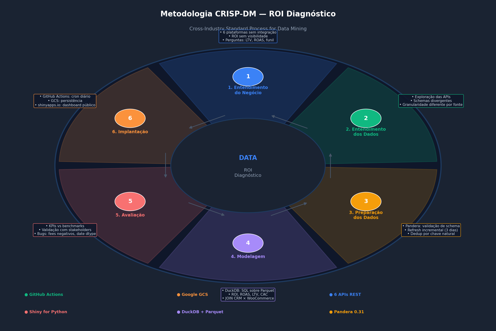
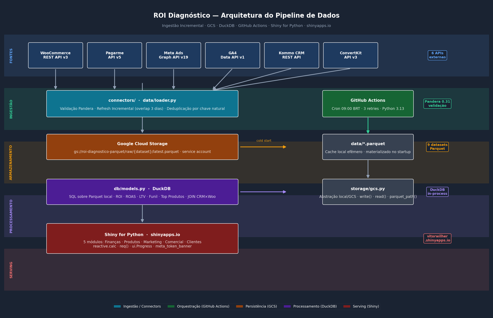

## Visão Geral

O **ROI Diagnóstico** é uma plataforma de inteligência comercial construída para consolidar em um único ambiente interativo os dados de vendas, tráfego pago, analytics, CRM, gateway de pagamento e e-mail marketing de um negócio digital de educação.

O projeto cobre o ciclo completo de engenharia de dados: **coleta → validação → armazenamento → processamento → visualização**, com infraestrutura 100% em nuvem e pipeline automatizado.

---

## Motivação

Negócios digitais que vendem cursos e infoprodutos operam com dados espalhados em seis ou mais plataformas distintas. Cada uma tem seu próprio painel, suas próprias métricas e sua própria lógica de atribuição. O problema prático: nenhuma se fala.

O resultado é que o gestor precisa abrir seis abas, exportar planilhas manualmente e ainda não tem certeza se está comparando o mesmo período, a mesma definição de "receita" ou o mesmo cliente. O ROI Diagnóstico resolve isso consolidando tudo em uma interface única, atualizada diariamente e acessível de qualquer dispositivo.

**Perguntas respondidas pelo dashboard:**

- Qual o ROI real das campanhas, descontando taxas de processamento e antecipação?
- Quais cursos geraram mais receita? Qual o ticket médio e LTV por produto?
- Quão eficiente é o funil de vendas — de lead a cliente convertido?
- Quem são os clientes de maior LTV e como contatá-los?
- Qual landing page converte mais sessões em receita?

---

## Metodologia — CRISP-DM

O projeto foi estruturado seguindo o processo **CRISP-DM** (*Cross-Industry Standard Process for Data Mining*), adaptado para engenharia de dados e analytics operacional.

{width=90%}

| Fase | Aplicação no Projeto |
|---|---|
| **1. Entendimento do Negócio** | Mapeamento das 6 plataformas, definição das métricas-chave (ROI, ROAS, LTV, CAC, taxa de conversão) e das perguntas que o dashboard precisa responder |
| **2. Entendimento dos Dados** | Exploração das APIs, identificação de schemas divergentes, granularidades diferentes (pedido vs. sessão vs. lead) e lacunas históricas |
| **3. Preparação dos Dados** | Pipeline com validação Pandera, refresh incremental com sobreposição de 3 dias, deduplicação por chave natural, normalização de tipos de data |
| **4. Modelagem** | Queries SQL via DuckDB sobre Parquet: ROI diário, ROAS por campanha, LTV por cliente, funil de conversão, JOIN CRM × WooCommerce |
| **5. Avaliação** | Validação dos KPIs com stakeholders, identificação e correção de bugs (taxas negativas de reembolso, incompatibilidades de tipo Pandera 0.31, merge de datas heterogêneas) |
| **6. Implantação** | GitHub Actions (cron diário), Google Cloud Storage (persistência), shinyapps.io (dashboard público) |

---

## Arquitetura de Dados

{width=100%}

O pipeline é composto por **cinco camadas independentes**:

### Camada 1 — Fontes de Dados

Seis APIs REST cobertas por conectores Python dedicados, cada um encapsulando autenticação, paginação e parsing de resposta:

| Fonte | API | Dados Coletados |
|---|---|---|
| **WooCommerce** | REST API v3 | Pedidos, receita, produtos, e-mail e telefone do cliente |
| **Pagarme** | API v5 | Taxas de processamento, antecipações, recebíveis por competência |
| **Meta Ads** | Graph API v19 | Campanhas, investimento, impressões, cliques, compras atribuídas, ROAS |
| **Google Analytics 4** | Data API v1 | Sessões, usuários, canais de aquisição, conversões, landing pages |
| **Kommo CRM** | REST API | Leads, status do funil, data de criação, e-mail do contato |
| **ConvertKit** | API v3 | Broadcasts, open rate, click rate, tamanho da base |

Histórico disponível desde **janeiro de 2019** (WooCommerce/Pagarme) e **janeiro de 2024** (Meta Ads, GA4, Kommo, ConvertKit).

### Camada 2 — Ingestão e Validação

Cada conector retorna um `pd.DataFrame` validado por um schema **Pandera**. O `data/loader.py` implementa **refresh incremental**:

```python
# Lê data máxima do cache → busca apenas dados novos
start = latest_date_in_cache - timedelta(days=3)  # 3 dias de sobreposição

df_new = connector.fetch(start, today)
df     = merge_incremental(df_existing, df_new, dedup_cols=["order_id"])
save(df)  # persiste localmente e no GCS
```

Vantagem: o primeiro refresh é completo (histórico desde 2019); os subsequentes buscam apenas dias recentes, levando segundos.

### Camada 3 — Armazenamento (Google Cloud Storage)

Os dados são persistidos em **Google Cloud Storage** no formato Parquet, permitindo que qualquer instância do app (local ou no servidor) carregue os dados sem depender de chamadas de API:

```
gs://roi-diagnostico-parquet/
└── raw/
    ├── woo/latest.parquet
    ├── pagarme/latest.parquet
    ├── meta/latest.parquet
    ├── ga4/latest.parquet
    ├── ga4_pages/latest.parquet
    ├── payables/latest.parquet
    ├── kommo/latest.parquet
    ├── convertkit/latest.parquet
    └── woo_items/latest.parquet
```

A camada `storage/gcs.py` abstrai completamente o acesso, com fallback para disco local via variável `ROI_STORAGE`:

```python
# local (desenvolvimento)
ROI_STORAGE=local   → data/*.parquet

# produção
ROI_STORAGE=gcs     → gs://roi-diagnostico-parquet/raw/*/latest.parquet
```

No startup do servidor (cold start), o app detecta ausência de Parquet local e carrega automaticamente do GCS — sem intervenção manual.

### Camada 4 — Processamento (DuckDB)

O módulo `db/models.py` substitui o `metrics/calculator.py` original por queries SQL executadas via **DuckDB in-process** diretamente sobre os arquivos Parquet locais:

```python
def query_roi(start: date, end: date) -> pd.DataFrame:
    return _q(f"""
    WITH orders AS (
        SELECT date, SUM(total) AS revenue
        FROM read_parquet('{_p("woo")}')
        WHERE date BETWEEN '{start}' AND '{end}'
        GROUP BY date
    ),
    fees AS (
        SELECT date,
               SUM(fee) AS pagarme_fee,
               SUM(anticipation_fee) AS anticipation_fee
        FROM read_parquet('{_p("payables")}')
        WHERE date BETWEEN '{start}' AND '{end}'
        GROUP BY date
    ),
    ...
    """)
```

DuckDB elimina a necessidade de carregar todos os dados em memória — executa filtros e agregações diretamente no Parquet, com desempenho comparável a bancos colunares.

**Queries implementadas:**

| Função | Resultado |
|---|---|
| `query_roi(start, end)` | Receita, taxas, lucro líquido, ROI por dia |
| `query_summary(start, end)` | KPIs consolidados do período |
| `query_roas(start, end)` | ROAS, CPC, CPA por campanha |
| `query_channels(start, end)` | Sessões e conversões por canal GA4 |
| `query_leads(start, end)` | Funil CRM por coorte de criação |
| `query_crm_woo()` | JOIN leads × pedidos (email matching) |
| `query_client(email)` | Perfil completo do cliente |
| `query_top_products(start, end, n)` | Ranking de produtos por receita |

### Camada 5 — Serving (Shiny for Python)

O `app.py` original de 1.300+ linhas foi refatorado para ~170 linhas usando o **sistema de módulos do Shiny for Python**. Cada aba é um módulo independente com sua própria UI e servidor:

```python
# app.py — registro de módulos
server_financas ("fin",  start_date=start_date, end_date=end_date, loaded=loaded)
server_produtos ("prod", loaded=loaded)
server_marketing("mkt",  start_date=start_date, end_date=end_date,
                 loaded=loaded, campanhas=campanhas)
server_comercial("crm",  loaded=loaded)
server_clientes ("cli",  loaded=loaded)
```

---

## Orquestração — GitHub Actions

O pipeline de ingestão diária roda no **GitHub Actions** (free tier), sem necessidade de servidor dedicado:

```yaml
# .github/workflows/daily_pipeline.yml
on:
  schedule:
    - cron: "0 12 * * *"   # 09:00 BRT = 12:00 UTC
  workflow_dispatch:         # disparo manual via UI

jobs:
  ingest:
    runs-on: ubuntu-latest
    steps:
      - uses: actions/checkout@v4
      - uses: actions/setup-python@v5
        with: { python-version: "3.13" }
      - run: pip install -r requirements.txt
      - run: echo '${{ secrets.GCS_CREDENTIALS_JSON }}' > ga4_credentials.json
      - run: python pipeline/run_pipeline.py
```

Todas as credenciais estão armazenadas como **GitHub Secrets** — nenhuma chave é versionada no repositório.

**Resultado:** 9 fontes de dados atualizadas diariamente às 09:00 BRT, com logs de execução públicos e alertas de falha por e-mail.

---

## Estrutura do Projeto

```
ROI_Diagnostico/
│
├── app.py                       # Shiny app (~170 linhas, modular)
│
├── connectors/                  # Conectores por fonte de dados
│   ├── woocommerce.py           # WooCommerce REST API v3 + WooOrderSchema
│   ├── pagarme.py               # Pagarme API v5 + PagarmeOrderSchema
│   ├── meta_ads.py              # Meta Graph API v19 + check_token()
│   ├── ga4.py                   # GA4 Data API v1 + GA4TrafficSchema
│   ├── kommo.py                 # Kommo CRM REST API + KommoLeadSchema
│   └── convertkit.py            # ConvertKit API v3 + ConvertKitSchema
│
├── data/
│   └── loader.py                # Cache GCS/local + refresh incremental
│
├── db/
│   ├── engine.py                # DuckDB connection factory
│   └── models.py                # Queries SQL sobre Parquet
│
├── storage/
│   └── gcs.py                   # Abstração GCS/local (ROI_STORAGE env)
│
├── modules/                     # Módulos Shiny por aba
│   ├── financas.py
│   ├── produtos.py
│   ├── marketing.py
│   ├── comercial.py
│   ├── clientes.py
│   └── utils.py                 # fmt_brl(), kpi_card(), big_kpi()
│
├── pipeline/
│   └── run_pipeline.py          # Script do GitHub Actions
│
├── .github/
│   └── workflows/
│       └── daily_pipeline.yml   # Cron 09:00 BRT
│
├── requirements.txt
└── .env                         # Credenciais (não versionado)
```

---

## Dashboard — Abas

### 1. Finanças

Visão macro do negócio no período selecionado.

**KPIs:** Receita Bruta · Taxa Pagarme · Taxa de Antecipação · Receita Líquida · Lucro Bruto (margem 30%) · Gasto em Ads · Lucro Líquido · ROI · ROAS · Total de Pedidos · Sessões

**Fórmulas:**
```
Receita Líquida = Receita Bruta − Taxa Pagarme − Taxa Antecipação
Lucro Bruto     = Receita Líquida × 0.30
Lucro Líquido   = Lucro Bruto − Gasto em Ads
ROI             = Lucro Líquido / Gasto em Ads × 100
ROAS            = Receita Atribuída Meta / Gasto em Ads
```

**Gráfico:** Barras mensais com receita, taxas, lucro e gasto sobrepostos.

---

### 2. Produtos

**Bloco 1 — Análise por Curso:** Receita total, quantidade vendida, ticket médio e evolução mensal do curso selecionado.

**Bloco 2 — Top 5 / Bottom 5:** Ranking de produtos mais e menos vendidos no período.

**Bloco 3 — Top 10 Histórico:** Área empilhada com os 10 cursos de maior receita, mostrando composição ao longo do tempo.

---

### 3. Marketing

**Google Analytics:** KPIs de sessões e conversões; gráfico de canais ao longo do tempo; tabela de top landing pages.

**Tráfego Pago (Meta Ads):** Tabela de campanhas do mês corrente com investimento, vendas, receita atribuída, CAC e ROAS (código de cores verde/amarelo/vermelho); gráfico investimento vs. receita por mês.

**E-mail (ConvertKit):** KPIs de base, open rate médio e click rate médio; tabela de broadcasts.

---

### 4. Comercial (CRM)

Análise de funil por **coorte de criação de lead**: dos leads criados no período, qual é o status atual?

**KPIs:** Total de leads · Convertidos · Taxa de conversão · Em aberto · Em negociação · Perdidos

**Gráfico de Funil:** 5 etapas com percentuais sobre o total da coorte.

**Gráfico de Leads por Mês:** Evolução mensal de criação de leads, separados por status.

---

### 5. Clientes

Busca individual por e-mail com perfil completo: nome, telefone/WhatsApp, classificação (Premium / Mediano / Iniciante), LTV, ticket médio, número de pedidos e histórico de cursos adquiridos.

---

## Infraestrutura de Deploy

```
┌─────────────────────────────────────────────────────────┐
│              INFRAESTRUTURA DE PRODUÇÃO                 │
├──────────────────┬──────────────────┬───────────────────┤
│  GitHub Actions  │  Google Cloud    │  shinyapps.io     │
│  (Orquestração)  │  Storage (GCS)   │  (Dashboard)      │
├──────────────────┼──────────────────┼───────────────────┤
│  Cron 09:00 BRT  │  9 Parquets      │  Shiny for Python │
│  Python 3.13     │  ~2 MB total     │  Free tier        │
│  19 secrets      │  Service account │  vitorwilher      │
│  Free tier       │  basedosdados-   │  .shinyapps.io    │
│                  │  343517          │                   │
└──────────────────┴──────────────────┴───────────────────┘
```

**Fluxo de atualização:**
```
GitHub Actions (09:00 BRT)
  └── Busca APIs com refresh incremental
  └── Valida schemas com Pandera
  └── Salva Parquet no GCS

shinyapps.io (cold start)
  └── Detecta data/ vazio
  └── Baixa Parquet do GCS via gcsfs
  └── DuckDB queries sobre Parquet local
  └── Dashboard renderizado
```

**Redeploy do dashboard** (quando necessário):
```bash
rsconnect deploy shiny . -n vitorwilher --title "ROI Diagnóstico"
```

---

## Problemas Resolvidos

### 1. app.py monolítico (1.300+ linhas)

**Problema:** Todo o código de UI, servidor, gráficos e cálculos em um único arquivo, impossível de manter.

**Solução:** Refatoração para sistema de módulos Shiny (`@module.ui` / `@module.server`). Cada aba virou um módulo independente; o `app.py` caiu para ~170 linhas.

---

### 2. Parquet local perdido no redeploy

**Problema:** Os arquivos `.parquet` precisavam ser empacotados junto com o deploy no shinyapps.io. A cada novo deploy (ou reinício do servidor), os dados se perdiam.

**Solução:** Google Cloud Storage como camada de persistência. No cold start, o app detecta `data/` vazio e carrega automaticamente do GCS. O bundle de deploy não precisa incluir dados.

---

### 3. Refresh manual sem pipeline automatizado

**Problema:** A atualização dos dados dependia de o usuário clicar no botão "Atualizar dados" no dashboard.

**Solução:** GitHub Actions com cron diário às 09:00 BRT. O pipeline roda independentemente do dashboard estar aberto ou não.

---

### 4. Token Meta Ads expirando silenciosamente

**Problema:** O token da Meta Graph API tem validade de ~60 dias. Com o token expirado, as chamadas falhavam silenciosamente — o cache antigo era usado sem aviso.

**Solução:**
- `check_token()` em `connectors/meta_ads.py`: consulta o endpoint `/debug_token` da Meta e retorna dias restantes
- `meta_token_banner` no `app.py`: banner vermelho (≤ 7 dias ou inválido) ou laranja (≤ 14 dias)
- `token_exchange.sh`: troca automática de token curto por long-lived token (60 dias) via Graph API

---

### 5. Pandera 0.31 — incompatibilidade de tipo `pa.Date`

**Problema:** `pa.Date` com `coerce=True` no Pandera 0.31 não conseguia coagir `datetime.date` (object dtype) nem strings ISO — lançava `"cannot be converted to int"`.

**Solução:** Uso de `pa.DateTime` no schema do ConvertKit (sem `pa.Date`); normalização de datas para string ISO antes do merge incremental via `_normalize_dates()`.

---

### 6. Taxas de reembolso quebrando validação

**Problema:** O Pagarme retorna taxas negativas em payables de reembolso. O schema definia `fee: Series[float] = pa.Field(ge=0)`, causando falha de validação nesses registros.

**Solução:** Remoção da constraint `ge=0` nas colunas `fee` e `anticipation_fee` — taxas negativas são válidas e representam devoluções de cobranças.

---

### 7. Queries lentas com Pandas puro

**Problema:** Cálculos de ROI com múltiplos merges e groupby em DataFrames de 10k+ linhas causavam latência perceptível ao mudar o filtro de data.

**Solução:** Substituição dos cálculos Pandas por queries SQL via DuckDB. O DuckDB executa filtros e agregações diretamente no Parquet (lazy evaluation), com desempenho 3-10× melhor para as queries típicas do dashboard.

---

## Tecnologias

| Camada | Tecnologia | Versão |
|---|---|---|
| **Framework web** | Shiny for Python | latest |
| **Validação de dados** | Pandera | 0.31 |
| **Query engine** | DuckDB | ≥ 0.10 |
| **Persistência** | Google Cloud Storage + gcsfs | latest |
| **Orquestração** | GitHub Actions | — |
| **Visualização** | Matplotlib | latest |
| **Dados** | Pandas, NumPy, PyArrow | latest |
| **Deploy** | rsconnect-python → shinyapps.io | latest |
| **Auth Google** | google-auth, google-cloud-storage | latest |
| **APIs** | requests | latest |
| **Ambiente** | python-dotenv | latest |

---

## Como Executar Localmente

### Pré-requisitos

- Python 3.11+
- Acesso às APIs (credenciais no `.env`)
- `ga4_credentials.json` (service account do Google Cloud)

### Instalação

```bash
git clone https://github.com/vitorwilher/roi-diagnostico.git
cd roi-diagnostico

python3 -m venv .venv
source .venv/bin/activate
pip install -r requirements.txt

cp .env.example .env
# edite .env com suas credenciais
```

### Execução

```bash
shiny run app.py --port 8080
```

Na primeira execução sem cache local, o app carrega os dados do GCS (se `ROI_STORAGE=gcs`) ou exibe dados vazios aguardando o clique em **"Atualizar dados"**.

### Variáveis de Ambiente

```bash
# Pagarme
PAGARME_SECRET_KEY=sk_xxxxxxxxxxxxx

# WooCommerce
WC_URL=https://seusite.com.br
WC_CONSUMER_KEY=ck_xxxxxxxxxxxxx
WC_CONSUMER_SECRET=cs_xxxxxxxxxxxxx

# Meta Ads
META_ACCESS_TOKEN=EAARxxxxxxxxxx
META_AD_ACCOUNT_ID=act_xxxxxxxxxx
META_APP_ID=xxxxxxxxxx
META_APP_SECRET=xxxxxxxxxx

# Kommo CRM
KOMMO_SUBDOMAIN=seusubdominio
KOMMO_LONG_TOKEN=xxxxxxxxxxxxxxxxx

# ConvertKit
CONVERTKIT_API_KEY=xxxxxxxxxxxxxxxxx
CONVERTKIT_API_SECRET=xxxxxxxxxxxxxxxxx

# Google Cloud Storage (opcional — default: local)
ROI_STORAGE=gcs
GCS_BUCKET=seu-bucket
GCS_CREDENTIALS_PATH=ga4_credentials.json
```

O arquivo `ga4_credentials.json` deve ser um JSON de service account do Google Cloud com permissão `roles/bigquery.dataViewer` na propriedade GA4 e `roles/storage.objectAdmin` no bucket GCS.

---

## Próximos Passos

- Alertas automáticos por e-mail quando ROI cair abaixo de threshold configurável
- Exportação de relatórios em PDF/Excel direto do dashboard
- Suporte a múltiplas contas de Meta Ads
- Integração com Hotmart ou outras plataformas de entrega de cursos
- Testes automatizados para conectores e queries (`pytest`)
- Indicador de data de última atualização no dashboard
