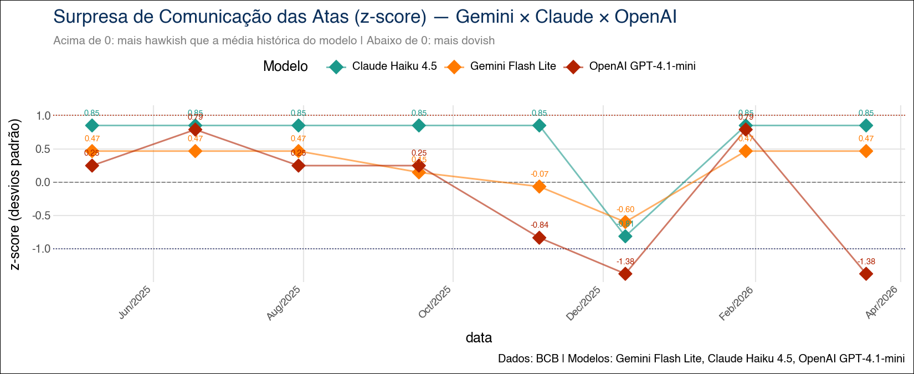

{width=100%}

::: {.callout-note}
## 📄 Working paper

Esta é a **ficha técnica do projeto** (metodologia CRISP-DM, arquitetura, sistema de versões). Para o *working paper* completo com abstract, *changelog* público e PDF para download, veja [**Sentimento COPOM — paper**](../research/sentimento-copom.html).
:::

## Visão Geral

Este projeto implementa, seguindo a metodologia **CRISP-DM** (*Cross-Industry Standard Process for Data Mining*), um *pipeline* completo para construir um **Índice de Tom *hawkish-dovish*** das atas do Comitê de Política Monetária (Copom) do Banco Central do Brasil utilizando **três modelos de linguagem de grande porte (LLMs)** em paralelo:

- **Gemini Flash Lite** (Google)
- **Claude Haiku 4.5** (Anthropic)
- **GPT-4.1-mini** (OpenAI)

O mesmo *prompt* é aplicado aos mesmos textos pelos três provedores via **LangChain**, com saída estruturada via **Pydantic** e cache local incremental que torna a publicação contínua do índice viável a custo marginal próximo de zero. Os *scores* brutos são calibrados em pontos percentuais equivalentes da Selic via regressão linear simples (`statsmodels.OLS`), e a robustez do exercício é testada em **três camadas complementares**: inferência *in-sample*, *holdout* das últimas reuniões e validação cruzada *walk-forward* sobre toda a amostra.

O artefato final é um *paper* técnico em **Quarto + LaTeX** versionado formalmente (CHANGELOG + snapshots por release), com duas edições paralelas — base auditável (com chunks visíveis) e edição do leitor (chunks ocultos).

::: {.callout-tip}
## Tese central

Os três modelos **concordam sobre a direção do tom** — qual ata é mais *hawkish* (sinaliza juros mais altos) ou *dovish* (sinaliza juros mais baixos) — mas **divergem sobre a intensidade** com que essa direção se traduz em variação da Selic. A sensibilidade calibrada $\hat{\beta}$ varia de $+0{,}36$ a $+0{,}62$ p.p. por unidade de *score*, uma diferença de mais de 70%.
:::

---

## Motivação

A comunicação dos bancos centrais é, em si, um **instrumento de política monetária**. As atas do Copom concentram, em escolhas sutis de linguagem, informação relevante sobre a direção futura da Selic. Quantificar esse "tom" — formalmente, mensurar o quão *hawkish* ou *dovish* uma ata é — permite:

1. **Construir séries quantitativas** a partir de texto, alimentando modelos macroeconômicos (regras de Taylor, VARs, modelos de surpresa monetária);
2. **Detectar viradas de ciclo monetário** antes que se traduzam em decisões formais de política;
3. **Comparar provedores de IA** em uma tarefa econômica concreta, com critério de calibração objetivo (variação efetiva da Selic).

O projeto responde a três perguntas práticas:

- **Os LLMs concordam entre si** ao ler as atas do Copom?
- Os *scores* têm **poder explicativo** sobre a variação subsequente da Selic?
- A escolha do provedor **altera materialmente** o resultado quando o índice é usado como variável quantitativa?

---

## Metodologia — CRISP-DM

O projeto foi estruturado seguindo o processo **CRISP-DM** (*Cross-Industry Standard Process for Data Mining*), adaptado ao contexto de **NLP com IA generativa aplicada à comunicação de bancos centrais**.

| Fase | Aplicação no Projeto |
|---|---|
| **1. Entendimento do Negócio** | Mapeamento da literatura (Loughran & McDonald 2011, Apel & Grimaldi 2012, Hansen & Kazinnik 2023), definição da escala $-3{,}0$ a $+3{,}0$ com âncoras explícitas, escolha da variável-alvo (variação efetiva da Selic) |
| **2. Entendimento dos Dados** | Inspeção das atas via API pública do BCB a partir da reunião 232 (ago/2020), análise estrutural das seções (A: diagnóstico; B: cenários e riscos; C: decisão) e da série SGS 432 (meta Selic) |
| **3. Preparação dos Dados** | *Scraping* programático, limpeza de HTML, extração das seções A+B (~50% menos *tokens*), alinhamento temporal ata × decisão Selic, cache incremental local em três níveis |
| **4. Modelagem** | *Prompt* unificado com âncoras *hawkish/dovish*; saída estruturada via Pydantic (`TomAta.score: float`); três LLMs em paralelo via LangChain; calibração OLS por modelo |
| **5. Avaliação** | **Três camadas**: inferência *in-sample* (β̂, SE, t, p, IC 95%, R², R²_adj), *holdout* das últimas 6 reuniões (RMSE, MAE), validação *walk-forward* com janela expansiva (n_pred = 26) |
| **6. Implantação** | *Pipeline* totalmente reprodutível em Quarto + Python; cache CSV por provedor permite reprocessamento incremental; sistema formal de releases (CHANGELOG + `versions/`); duas edições paralelas (base × público) |

---

## Arquitetura do Pipeline

```{mermaid}
flowchart LR
  subgraph Coleta
    BCB[(API BCB<br>atas + SGS 432)]
    BCB --> A[atas_cache.json]
    BCB --> S[selic_cache.json]
  end

  subgraph Preparação
    A --> P[Limpeza HTML<br>+ Seções A B]
  end

  subgraph Modelagem
    P --> L1[LangChain<br>Gemini Flash Lite]
    P --> L2[LangChain<br>Claude Haiku 4.5]
    P --> L3[LangChain<br>GPT-4.1-mini]
    L1 --> C1[scores_gemini_cache.csv]
    L2 --> C2[scores_claude_cache.csv]
    L3 --> C3[scores_openai_cache.csv]
  end

  subgraph Calibração e Validação
    C1 --> OLS[statsmodels.OLS<br>ΔSelic = α + β·score + ε]
    C2 --> OLS
    C3 --> OLS
    S  --> OLS
    OLS --> V1[In-sample<br>β̂, IC, R²]
    OLS --> V2[Holdout<br>últimas 6 atas]
    OLS --> V3[Walk-forward<br>n_pred=26]
  end

  V1 --> PDF([Quarto Render PDF])
  V2 --> PDF
  V3 --> PDF
```

---

## 1. Entendimento do Negócio

### 1.1 Problema

Bancos centrais comunicam decisões de política monetária por meio de textos cuidadosamente redigidos — atas, comunicados, relatórios de inflação. A *informação* relevante para o mercado não está apenas na decisão final (subir, manter ou cortar a Selic), mas no **tom** com que o cenário é descrito. Quantificar esse tom é um problema clássico de **NLP aplicado**, com solução tradicional via dicionários (Loughran & McDonald, 2011) e, mais recentemente, via *embeddings* e LLMs (Hansen & Kazinnik, 2023).

### 1.2 Objetivos

1. Construir um **Índice de Tom *hawkish-dovish*** das atas do Copom com escala interpretável ($-3{,}0$ a $+3{,}0$);
2. **Calibrar** o índice em pontos percentuais equivalentes da Selic, tornando-o utilizável como *input* quantitativo;
3. Comparar **três provedores de LLM** sob o mesmo *prompt* e validar cada calibração formalmente;
4. **Versionar** todo o exercício de forma reprodutível, com sistema de releases que preserva snapshots auditáveis.

### 1.3 Critérios de sucesso

| Critério | Meta |
|---|---|
| Concordância direcional entre modelos | Correlação $> 0{,}6$ entre *scores* brutos |
| Significância estatística | $\hat{\beta}$ com $p < 0{,}05$ no exercício *in-sample* |
| Poder preditivo *out-of-sample* | RMSE *walk-forward* melhor que *baseline* léxico |
| Custo operacional | < US$ 1 para reprocessar amostra completa |
| Reprodutibilidade | *Pipeline* roda do zero apagando os caches CSV |

---

## 2. Entendimento dos Dados

### 2.1 Fontes

| Fonte | API | Dados Coletados |
|---|---|---|
| **Banco Central do Brasil** | API de Atas do Copom | Texto integral das atas em HTML, a partir da reunião 232 (ago/2020) |
| **Banco Central do Brasil** | SGS — série 432 | Meta Selic definida pelo Copom (data e valor por reunião) |

### 2.2 Estrutura das atas

Cada ata segue um *template* canônico com três blocos:

| Seção | Conteúdo | Uso no projeto |
|---|---|---|
| **A** | Diagnóstico do cenário (atividade, inflação, externo) | **Usada** |
| **B** | Cenários e balanço de riscos | **Usada** |
| **C+** | Anúncio formal da decisão (juros, direção, votos) | **Descartada** |

A seção C+ é descartada porque já anuncia a decisão conhecida — usá-la contaminaria o exercício com *look-ahead bias*. As seções A+B reduzem o consumo de *tokens* em cerca de 50% sem perder a informação prospectiva de tom.

### 2.3 Recorte amostral

Início em **agosto de 2020** (reunião 232) — primeira ata pós-pandemia em que o Banco Central do Brasil adota o atual *template* estrutural. Recortes anteriores teriam textos de formato heterogêneo, comprometendo a comparabilidade.

---

## 3. Preparação dos Dados

### 3.1 Pipeline de coleta

Implementado em chunks Python diretamente no `.qmd`, com cache local em três níveis:

```python
# 1) Atas via API do BCB
atas = baixar_atas_copom(reuniao_inicio=232)         # → atas_cache.json
# 2) Selic via SGS 432
selic = baixar_selic_sgs(serie=432)                  # → selic_cache.json
# 3) Limpeza e extração de seções A+B
textos = [extrair_secoes_AB(html) for html in atas]
```

O cache é **incremental por reunião** — só baixa do BCB o que ainda não está no JSON. Para reprocessar do zero, basta apagar o cache.

### 3.2 Cache incremental por LLM

Cada provedor mantém seu próprio CSV:

```
scores_gemini_cache.csv
scores_claude_cache.csv
scores_openai_cache.csv
```

Uma reunião só é re-inferida se o *score* não existir no CSV. Isso significa que rodar o `.qmd` após uma nova reunião do Copom envolve **uma única chamada por provedor** (custo total < US$ 0,01). Reprocessar tudo é uma decisão consciente: apaga-se o CSV e o pipeline regenera.

### 3.3 Decisões de preparação

| Decisão | Valor | Justificativa |
|---|---|---|
| Reunião inicial | 232 (ago/2020) | Template estrutural estável a partir desta reunião |
| Seções utilizadas | A + B | Diagnóstico e riscos — descarta decisão já conhecida |
| Variável-alvo | $\Delta$Selic (p.p.) | Variação na decisão da reunião subsequente |
| Cache | CSV por provedor | Permite reprocessamento seletivo por modelo |

---

## 4. Modelagem

### 4.1 Prompt unificado com âncoras explícitas

O mesmo *prompt* é enviado aos três provedores. Trecho-chave:

> *"Classifique o tom desta ata do Copom em uma escala contínua de $-3{,}0$ (fortemente *dovish*, sinaliza corte agressivo de juros) a $+3{,}0$ (fortemente *hawkish*, sinaliza alta agressiva), com âncoras: $-2{,}0$ corte moderado; $-1{,}0$ leve viés baixista; $0{,}0$ neutro; $+1{,}0$ leve viés altista; $+2{,}0$ alta moderada. Retorne apenas o número."*

Saída estruturada via **Pydantic**:

```python
class TomAta(BaseModel):
    score: float = Field(ge=-3.0, le=3.0)
```

LangChain força o *output* a satisfazer o *schema* — qualquer texto livre ou *score* fora da faixa é rejeitado e re-pedido.

### 4.2 Três LLMs em paralelo

| Provedor | Modelo | Cache nativo |
|---|---|---|
| **Google** | `gemini-flash-lite-latest` | — |
| **Anthropic** | `claude-haiku-4-5` | `cache_control: ephemeral` (prompt caching) |
| **OpenAI** | `gpt-4.1-mini` | — |

O Claude usa o *prompt caching* nativo da Anthropic (bloco de instruções marcado com `cache_control: ephemeral`), o que reduz custo e latência a partir da segunda chamada quando atende ao mínimo de *tokens*.

### 4.3 Calibração OLS

Para cada modelo, ajusta-se uma regressão linear simples:

$$
\Delta\text{Selic}_t = \alpha + \beta \cdot \text{score}_t + \varepsilon_t
$$

Cada modelo recebe seus próprios $\hat{\alpha}$, $\hat{\beta}$, $R^2$. A calibração transforma o *score* bruto (em unidades de "tom") em uma quantidade economicamente interpretável (pontos percentuais de variação esperada da Selic).

### 4.4 Baseline metodológico — léxico hawkish/dovish em PT-BR

Como contraponto às LLMs, implementou-se um **dicionário hawkish/dovish em português** adaptado ao Copom (espírito Loughran-McDonald). O *score* léxico é a frequência líquida de termos *hawkish* menos *dovish*. Serve como *baseline* não-LLM para os exercícios de validação.

---

## 5. Avaliação

A robustez do exercício é testada em **três camadas complementares** — uma escolha metodológica deliberada, dado o tamanho moderado da amostra ($n = 46$ atas no estado atual).

### 5.1 Camada 1 — Inferência *in-sample*

`statsmodels.OLS` reporta, para cada um dos 4 modelos (3 LLMs + baseline léxico):

- $\hat{\beta}$ e seu erro-padrão
- Estatística-$t$, $p$-valor
- Intervalo de confiança 95%
- $R^2$ e $R^2_{\text{adj}}$

### 5.2 Camada 2 — Holdout

Treino nas primeiras $n - 6$ reuniões, teste nas **últimas 6**. Reporta RMSE e MAE *out-of-sample*.

### 5.3 Camada 3 — Walk-forward expanding window

Janela de treino mínima de **20 atas**, predição da próxima, expansão da janela em uma observação, repete até esgotar a amostra. Resulta em $n_{\text{pred}} = 26$ predições genuinamente *out-of-sample*. RMSE e MAE da walk-forward são as métricas mais conservadoras e respeitam a ordem temporal — nenhum dado futuro contamina o treino.

### 5.4 Achados centrais (estado em abr/2026)

| Modelo | $R^2$ in-sample | $\hat{\beta}$ | RMSE walk-forward |
|---|---:|---:|---:|
| **OpenAI GPT-4.1-mini** | **0,66** | $+0{,}50$ | **0,357** (líder) |
| **Claude Haiku 4.5** | 0,43 | $+0{,}62$ | ~0,67 |
| **Gemini Flash Lite** | 0,35 | $+0{,}36$ | ~0,67 |
| **Baseline léxico** | (referência) | — | ~0,52 |

**Interpretação:**

- **GPT-4.1-mini lidera** in-sample e out-of-sample (RMSE walk-forward ~32% melhor que o baseline léxico).
- **Claude tem maior sensibilidade** in-sample mas *overfit* claro — RMSE quase dobra fora da amostra.
- **Gemini é o mais conservador**, comprime amplitude do *score*; empata com Claude na walk-forward.
- **Baseline léxico** vence o holdout (artefato de janela calma) mas volta ao último na walk-forward, confirmando que a vantagem das LLMs é **genuína sobre o ciclo completo**, não um artefato.

::: {.callout-note}
## Histórico relevante

A troca **`gpt-4o-mini` → `gpt-4.1-mini`** elevou $R^2$ de ~0,11 para ~0,66 — geração de modelo importa de forma material para esta tarefa.
:::

---

## Surpresa de Comunicação (z-score)

{width=100%}

Além do índice calibrado, o *paper* reporta a **surpresa de comunicação** — o *score* do modelo padronizado (z-score) usando a média e o desvio-padrão históricos. Picos relevantes de $|z| > 1{,}5$ identificam atas em que o tom desvia fortemente do comportamento médio do Comitê, oferecendo uma medida natural de "evento de comunicação".

---

## Sistema de Versões

Uma escolha metodológica importante deste projeto é o **sistema formal de releases**, ausente em *papers* tradicionais mas natural em projetos reproduzíveis com infraestrutura de software.

### Estrutura do paper — arquivos duplos

| Arquivo | Propósito | YAML |
|---|---|---|
| `sentimento_copom_IA_base.qmd` | Edição auditável (técnica) | `echo: true` |
| `sentimento_copom_IA_publico.qmd` | Edição do leitor | `echo: false` |
| `referencias.bib` | Bibliografia única | — |

Diferem em **duas linhas**: `echo` no YAML e o sufixo "Edição do leitor" na *titlepage*. Mudanças de prosa, tabelas, abstract e *bibtex* atualizam **ambos** os arquivos; mudanças de chunks de código vão apenas no `base.qmd` e o público herda automaticamente porque os chunks ficam invisíveis lá.

::: {.callout-note}
## Por que dois arquivos físicos em vez de profile do Quarto

Profiles do Quarto seriam tecnicamente mais elegantes, mas dois arquivos com nomes auto-explicativos (`_base.qmd` × `_publico.qmd`) tornam o repositório mais legível para terceiros que chegam pelo GitHub.
:::

### CHANGELOG e snapshots

```
sentimento_copom/
├── CHANGELOG.md                        # formato Keep-a-Changelog
├── versions/
│   ├── v1.0_2026-04-26/                # snapshot da release v1.0
│   │   ├── sentimento_copom_IA_base.qmd
│   │   ├── sentimento_copom_IA_publico.qmd
│   │   ├── referencias.bib
│   │   └── CHANGELOG.md
│   └── v2.0_YYYY-MM-DD/                # próximas releases
└── _rollback/                          # checkpoints ad-hoc de sessão
    └── YYYY-MM-DD_T<HH>_<descritivo>/
```

| | `versions/` | `_rollback/` |
|---|---|---|
| Propósito | Releases formais | Checkpoints ad-hoc de sessão |
| Trigger | "marca como vX.Y" / fim de feature | "marca esse ponto como rollback" |
| Persistência | Permanente, vai para o repositório | Local, pode ser limpo |
| *Naming* | `vX.Y_AAAA-MM-DD/` | `AAAA-MM-DD_TXX_descritivo/` |

### Convenção de bumps

- **Major (vX.0)** — nova rodada metodológica completa (probit ordenado, ensemble, modelos maiores, nova validação).
- **Minor (v1.X)** — próximos passos atacados, novos achados empíricos, expansão da literatura.
- **Patch (v1.0.X)** — correções de prosa, ajustes editoriais.

### *Workflow* de release

```{mermaid}
flowchart LR
  A[Edição em<br>base.qmd] --> B{Tipo de<br>mudança?}
  B -->|prosa, tabelas, YAML| C[Sincroniza para<br>publico.qmd]
  B -->|código Python| D[Apenas base.qmd<br>público herda]
  C --> E[Commit no Git]
  D --> E
  E --> F{Release?}
  F -->|sim| G[Bump titlepage<br>+ CHANGELOG entry<br>+ snapshot em versions/]
  F -->|não| H[Continua<br>na mesma versão]
```

---

## Estrutura do Projeto

```
Sentimento_COPOM/
│
├── sentimento_copom_IA_base.qmd       # paper técnico (echo: true)
├── sentimento_copom_IA_publico.qmd    # edição do leitor (echo: false)
├── referencias.bib                    # bibliografia compartilhada
│
├── atas_cache.json                    # cache de atas do BCB
├── selic_cache.json                   # cache da série SGS 432
├── scores_gemini_cache.csv            # scores Gemini Flash Lite
├── scores_claude_cache.csv            # scores Claude Haiku 4.5
├── scores_openai_cache.csv            # scores GPT-4.1-mini
│
├── sentimento_copom_indice.png        # gráfico do índice calibrado
├── sentimento_copom_zscore.png        # gráfico do z-score
├── AM.png                             # logotipo na titlepage
│
├── CHANGELOG.md                       # histórico de releases
├── versions/                          # snapshots por release
│   └── v1.0_2026-04-26/
├── _rollback/                         # checkpoints de sessão
│
├── portfolio/                         # template de divulgação
│   ├── sentimento-copom.qmd           # ESTE arquivo (CRISP-DM)
│   ├── README.md                      # README do GitHub
│   └── *.png                          # imagens de capa
│
└── divulgacao/                        # marketing e templates de release
```

---

## Tecnologias

| Camada | Tecnologia |
|---|---|
| **Renderização** | Quarto + LaTeX (xelatex) |
| **Pacotes LaTeX** | `booktabs`, `threeparttable` (padrão JEL/AER) |
| **Linguagem** | Python 3.13 |
| **Orquestração de LLMs** | LangChain |
| **Saída estruturada** | Pydantic |
| **Provedores de LLM** | `google-genai`, `anthropic`, `openai` |
| **Cache de prompt** | `cache_control: ephemeral` (Anthropic) |
| **Inferência estatística** | `statsmodels` (OLS, IC, p-valores) |
| **Visualização** | `plotnine` |
| **Coleta de dados** | `requests` (API BCB) |
| **Ambiente** | `python-dotenv` |

---

## Como Executar Localmente

### Pré-requisitos

- Python 3.11+
- Quarto ≥ 1.4
- TeX Live (para renderização PDF)
- Chaves de API: Google AI Studio, Anthropic, OpenAI

### Instalação

```bash
git clone https://github.com/vitorwilher/Sentimento_COPOM.git
cd Sentimento_COPOM

python3 -m venv .venv
source .venv/bin/activate
pip install -r requirements.txt

cp .env.example .env
# edite .env com suas chaves
```

### Variáveis de ambiente

```bash
GOOGLE_API_KEY=...
ANTHROPIC_API_KEY=...
OPENAI_API_KEY=...
```

### Renderização

```bash
# Edição auditável (com chunks)
quarto render sentimento_copom_IA_base.qmd

# Edição do leitor (sem chunks)
quarto render sentimento_copom_IA_publico.qmd
```

### Reprocessamento total

```bash
# Apaga caches para forçar re-inferência completa
rm scores_*_cache.csv
quarto render sentimento_copom_IA_base.qmd
```

---

## Próximos Passos (v2.0)

1. **Capacidade antecedente $t \to t+1$** — regressão preditiva da variação subsequente da Selic;
2. **Robustez a perturbações de *prompt*** — variar redação, ordem das âncoras, idioma; medir variância entre execuções;
3. **Índice ensemble** — média simples ou ponderada por $R^2$ dos três *scores* calibrados;
4. **Inspeção qualitativa de divergências** — atas em que os modelos discordam mais (linguisticamente ambíguas);
5. **Modelos maiores** — `gpt-4.1`, `claude-sonnet-4-5`, `gemini-2.5-pro`;
6. **Probit ordenado** — modelo de classificação de viés (alta / manutenção / corte) como alternativa ao OLS;
7. **Comunicados oficiais** — estender o pipeline aos comunicados (mais curtos e mais frequentes);
8. **Surpresa de comunicação ortogonalizada** — resíduo do tom controlando expectativas Focus.

---

## Referências

- Apel, M.; Grimaldi, M. (2012). *The Information Content of Central Bank Minutes*. Riksbank Working Paper.
- Bholat, D.; Hansen, S.; Santos, P.; Schonhardt-Bailey, C. (2015). *Text Mining for Central Banks*. Bank of England.
- Blinder, A. S.; Ehrmann, M.; Fratzscher, M.; De Haan, J.; Jansen, D.-J. (2008). *Central Bank Communication and Monetary Policy*. *Journal of Economic Literature*, 46(4), 910–945.
- Caruso, A. (2026). *Comunicação do Banco Central do Brasil e o Mercado Financeiro: Uma Análise Textual*.
- Hansen, S.; Kazinnik, S. (2023). *Can ChatGPT Decipher Fedspeak?*. Working Paper.
- Hansen, S.; McMahon, M. (2016). *Shocking Language: Understanding the Macroeconomic Effects of Central Bank Communication*. *Journal of International Economics*, 99, S114–S133.
- Hansen, S.; McMahon, M.; Prat, A. (2018). *Transparency and Deliberation Within the FOMC: A Computational Linguistics Approach*. *Quarterly Journal of Economics*, 133(2), 801–870.
- Hubert, P.; Labondance, F. (2021). *The Signaling Effects of Central Bank Tone*. *European Economic Review*, 133.
- Loughran, T.; McDonald, B. (2011). *When Is a Liability Not a Liability? Textual Analysis, Dictionaries, and 10-Ks*. *Journal of Finance*, 66(1), 35–65.
- Picault, M.; Renault, T. (2017). *Words Are Not All Created Equal: A New Measure of ECB Communication*. *Journal of International Money and Finance*, 79.
- Wirth, R.; Hipp, J. (2000). *CRISP-DM: Towards a Standard Process Model for Data Mining*.
- Woodford, M. (2003). *Interest and Prices: Foundations of a Theory of Monetary Policy*. Princeton University Press.
