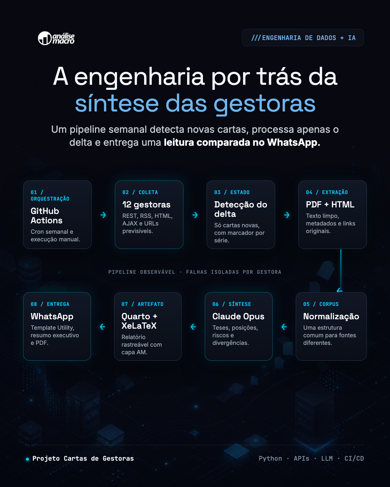

{width=100%}

## Visão geral

Este projeto transforma um processo editorial trabalhoso — acompanhar as cartas
das principais gestoras brasileiras e comparar suas leituras de cenário — em um
pipeline semanal, incremental e rastreável.

O sistema monitora **12 gestoras**, detecta somente as publicações novas desde a
última execução, extrai documentos em PDF ou HTML, normaliza o corpus e usa o
Claude para produzir uma leitura comparativa de **teses, mudanças de
posicionamento e riscos**. O resultado é renderizado em PDF com Quarto e enviado
automaticamente pelo WhatsApp.

> **Repositório:** [github.com/vitorwilher/cartas-de-gestoras](https://github.com/vitorwilher/cartas-de-gestoras) ·
> **Síntese de exemplo:** [PDF de 11 de agosto de 2026](https://github.com/vitorwilher/cartas-de-gestoras/blob/main/digests/resumo/resumo-2026-08-11.pdf)

## O problema de engenharia

As fontes não oferecem uma interface uniforme. Entre as 12 gestoras há APIs
REST do WordPress, feeds RSS, páginas HTML, endpoints AJAX, cartas inline e PDFs
com URLs pouco previsíveis. A periodicidade também varia: dez fontes são mensais
e duas publicam ensaios em cadência irregular; algumas mantêm mais de uma série
de cartas simultaneamente.

Por isso, o pipeline não depende de uma “data do mês”. Ele mantém um marcador de
estado por gestora e por série, descobre o delta real e trata a ausência de novas
cartas como uma saída válida. Uma mudança de layout ou indisponibilidade em uma
fonte é isolada e não interrompe as demais.

## Arquitetura

```{mermaid}
flowchart LR
  GH["GitHub Actions<br/>terça · 07:00 BRT"] --> FONTES["12 gestoras"]
  FONTES --> REST["WordPress REST"]
  FONTES --> RSS["RSS"]
  FONTES --> HTML["HTML"]
  FONTES --> AJAX["AJAX"]
  FONTES --> URL["URL previsível"]
  REST --> DELTA{"Carta nova?"}
  RSS --> DELTA
  HTML --> DELTA
  AJAX --> DELTA
  URL --> DELTA
  DELTA -->|sim| EXT["Extração PDF + HTML"]
  DELTA -->|não| SIL["Silêncio"]
  EXT --> NORM["Normalização"]
  NORM --> LLM["Claude<br/>síntese comparativa"]
  LLM --> PDF["Quarto + XeLaTeX<br/>PDF"]
  PDF --> WA["WhatsApp Cloud API<br/>template UTILITY"]
  PDF --> STATE["Commit do digest<br/>+ novo estado"]
```

## Decisões técnicas centrais

| Camada | Implementação |
|---|---|
| Orquestração | GitHub Actions, cron semanal e disparo manual |
| Coleta | `httpx` + BeautifulSoup, com cinco estratégias específicas |
| Estado | `gestoras.yml`, versionado por fonte e série |
| Extração | `pdfplumber` para PDF e parser HTML para cartas inline |
| Síntese | Anthropic Claude com streaming e *adaptive thinking* |
| Documento | Quarto + XeLaTeX, com identidade da Análise Macro |
| Entrega | WhatsApp Cloud API, documento no cabeçalho de template `UTILITY` |
| Qualidade | testes unitários e isolamento de falhas por gestora |

## O que a síntese entrega

Em vez de apenas resumir cada documento, a análise preserva a fonte como unidade
de leitura e termina com uma comparação transversal. Isso permite responder:

- qual é a tese central de cada gestora;
- o que mudou em relação à carta anterior;
- quais riscos cada casa considera mais relevantes;
- onde há convergência de cenário;
- onde o consenso se rompe.

Os links das cartas originais permanecem no documento, mantendo a análise
auditável. Os PDFs brutos não são versionados: pertencem às respectivas gestoras.

## Operação semanal

Toda terça-feira, às 07:00 BRT, a automação testa o código, consulta as fontes e
processa somente o delta. Havendo novidades, gera o PDF, envia pelo WhatsApp com
um resumo específico da edição e persiste o novo estado no repositório. Sem carta
nova, não produz ruído nem mensagem vazia.

Esse desenho combina coleta heterogênea, processamento documental, LLM, geração
de relatório e mensageria em um fluxo observável e reproduzível — a parte de
“engenharia” que fica invisível quando se olha apenas para o PDF final.
