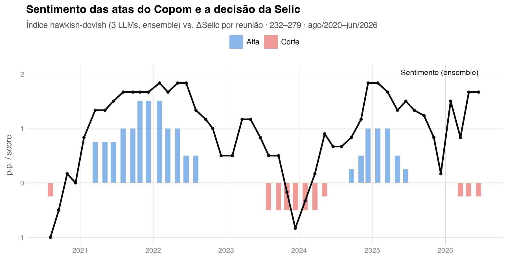

{width=100%}

::: {.callout-note}
## 🔗 Projeto-mãe: Sentimento COPOM

Este trabalho é uma **extensão direta** do [**Sentimento COPOM**](sentimento-copom.html). Lá, construímos um Índice de Tom *hawkish-dovish* das atas do Copom com **três LLMs em paralelo** (Gemini Flash Lite, Claude Haiku 4.5, GPT-4.1-mini). **Aqui**, esse índice deixa de ser o objeto final e vira um **regressor** numa **Regra de Taylor** — e, na rodada atual, é *reconstruído*: o corpus A+B das atas passa a ser lido integralmente e o tom é decomposto em dimensões econômicas distintas.

Uma correção importante em relação à versão anterior desta ficha: as regressões usam os ***scores* brutos em $[-3, +3]$** (padronizados por z-score), **não** a série calibrada em pontos percentuais da Selic disponível no projeto de origem. Não há, portanto, vazamento mecânico da calibração OLS do projeto-mãe para a Regra de Taylor estimada aqui.
:::

## Visão Geral

Este projeto testa, seguindo a metodologia **CRISP-DM**, uma pergunta de economia monetária aplicada: **o sentimento da comunicação do Copom, medido por LLMs, tem informação sobre a Selic que os fundamentos macro não capturam?**

A resposta encontrada é mais interessante — e mais restritiva — do que a hipótese inicial sugeria. O tom **explica** a Selic contemporânea com folga e o **balanço de riscos de inflação antecipa** a decisão da reunião seguinte. Mas quando se confronta esse conteúdo antecedente com a expectativa do mercado medida **antes** da reunião, o efeito se revela **integralmente absorvido pela expectativa**: a linguagem desloca o consenso, não a surpresa.

::: {.callout-important}
## Tese central (revisada)

A hipótese original era que o tom carrega sinal *incremental* sobre a decisão. Os resultados obrigam a **reposicionar a pergunta**: o balanço de riscos antecipa a ΔSelic da reunião seguinte em **+0,146 p.p. por desvio-padrão** ($p = 0{,}001$), mas desloca a **expectativa média do Questionário Pré-Copom em +13,3 pontos-base** — praticamente toda a decisão realizada (+12,9 pb). A **surpresa** residual é de **−0,4 pb**, estatisticamente indistinguível de zero. A comunicação do Copom opera como **mecanismo de sinalização compartilhado com o mercado**, não como choque monetário autônomo.
:::

---

## Motivação

A Regra de Taylor [@taylor1993] postula que o banco central ajusta a taxa de juros em resposta a dois desvios: a inflação em relação à meta e o produto em relação ao potencial. É uma das relações mais estimadas em macroeconomia — mas trata a comunicação do banco central como ruído. Ao mesmo tempo, uma literatura crescente mostra que a *comunicação* é, em si, um instrumento de política monetária [@blinder2008; @hansen2018].

O projeto-mãe transformou esse tom em série quantitativa. Este projeto fecha o elo, colocando as duas peças na mesma regressão — e depois submete o resultado a um teste que boa parte da literatura de *central bank communication* não faz: **descontar o que o mercado já esperava**.

### Perguntas de pesquisa

1. **O sentimento sobrevive aos controles?** Com hiato do produto e desvio de inflação na regressão, $\hat{\delta}$ permanece positivo e significante?
2. **O tom antecede a decisão?** O sentimento da ata $t$ prevê a ΔSelic da reunião $t+1$ — ou isso é contemporaneidade disfarçada?
3. **Qual dimensão da linguagem carrega o sinal?** Diagnóstico retrospectivo, orientação prospectiva e balanço de riscos são objetos econômicos distintos; agregá-los num único índice pode estar misturando informação com ruído.
4. **O sinal é antecipação ou surpresa?** Se o mercado já precifica o conteúdo da ata, o efeito sobre a decisão não é informação nova.
5. **A conclusão depende do LLM?** Sinal e significância são estáveis entre Claude, Gemini e OpenAI?

---

## A auditoria que reorientou o projeto

A versão inicial deste trabalho estimava a Regra de Taylor com o índice agregado herdado. Uma auditoria do corpus revelou duas coisas — uma tranquilizadora e uma que exigiu refazer a escoragem:

::: {.callout-warning}
## O que a auditoria encontrou

**Sem vazamento (verificado).** A extração já excluía corretamente a **seção C** das atas, que contém discussão, decisão e votação. E os *scores* usados são as saídas brutas dos modelos em $[-3, +3]$ — a calibração em p.p. da Selic nunca entrou nesta base.

**Truncagem material (corrigida).** A extração legada limitava as seções A+B a **4.500 caracteres**. O corte atingiu **35 das 48 atas**. Entre as atas truncadas, a extração integral recuperou **mediana de 6.042 caracteres** (máximo de 10.061) — cobertura temporal desigual, com risco de eliminar justamente o conteúdo prospectivo das atas mais longas.
:::

A resposta foi reconstruir o corpus (`data/raw/atas_full_cache.json`, seções A+B integrais, seção C excluída) e **reescorar as 48 atas** em dimensões separadas, com cada justificativa vinculada a um identificador de parágrafo (`P01`, `P02`, …) para auditabilidade.

### O índice prospectivo em quatro dimensões

| Dimensão | O que mede |
|---|---|
| `tom_retrospectivo` | Leitura dos dados e condições **já observadas** |
| `orientacao_prospectiva` | Indicação explícita sobre a **postura monetária futura** |
| `balanco_riscos_inflacao` | **Assimetria dos riscos** para a inflação |
| `confianca` | Grau de clareza da classificação (diagnóstico de validade) |

---

## Metodologia — CRISP-DM

| Fase | Aplicação no Projeto |
|---|---|
| **1. Entendimento do Negócio** | Regra de Taylor *forward-looking* com suavização (@taylor1993; @clarida2000). Hipótese testável: o tom adiciona poder explicativo além de hiato e desvio de inflação — e, na rodada revisada, se esse conteúdo é **antecipação** ou **surpresa** |
| **2. Entendimento dos Dados** | Cinco blocos: Selic (SGS 432); corpus integral das atas; Focus IPCA 12m suavizada; hiato (IBC-Br, SGS 24364); **Questionário Pré-Copom** (42 edições quantitativas, reuniões 238+). A unidade é a **reunião do Copom** (232–279), não o mês |
| **3. Preparação dos Dados** | `01_build_base.py` monta `base_taylor.csv` (48 reuniões). `09_prepare_forward_texts.py` reconstrói o corpus A+B sem truncagem. `14/15_*` coletam o QPC e constroem a surpresa da decisão. *Cache* incremental por fonte |
| **4. Modelagem** | OLS com erros **HAC (Newey-West, 2 defasagens)** como referência; **TSLS e GMM em dois passos** para endogeneidade; **filtro de Kalman** como hiato alternativo; **VAR** e **VECM** como exploratórios; **regressões móveis** para estabilidade; **bootstrap (5.000 réplicas)** e ***leave-one-out*** na especificação de surpresa |
| **5. Avaliação** | Significância de $\hat{\delta}$; ganho de $\bar{R}^2$; decomposição por dimensão textual; **identidade decisão = expectativa + surpresa**; robustez ao provedor de LLM e à fonte do hiato; **validação cega por dois agentes independentes** |
| **6. Implantação** | *Paper* reprodutível em Quarto + LaTeX; base regenerável apagando o *cache*; CHANGELOG + `versions/` |

---

## Arquitetura

```{mermaid}
flowchart LR
  subgraph Corpus["Corpus reconstruído"]
    ATAS[(atas_full_cache.json<br>seções A+B integrais<br>seção C excluída)]
  end

  subgraph Coleta["Coleta via API BCB"]
    SGS432[(SGS 432<br>meta Selic)]
    FOCUS[(Focus IPCA 12m)]
    META[(SGS 13521<br>meta de inflação)]
    IBC[(SGS 24364<br>IBC-Br dessaz.)]
    QPC[(Questionário Pré-Copom<br>42 edições)]
  end

  ATAS --> SCORE[["Escoragem 3 LLMs<br>4 dimensões · evidência por parágrafo"]]
  SCORE --> VALID{{"Validação cega<br>2 agentes independentes"}}
  VALID --> BUILD
  SGS432 --> BUILD
  FOCUS --> BUILD
  META --> BUILD
  IBC --> BUILD

  BUILD[["base_taylor.csv<br>48 reuniões"]] --> EST

  subgraph EST["Estimação"]
    M01["M0 / M1<br>contemporânea"]
    M2["M2 antecedente<br>por dimensão"]
    IV["TSLS / GMM"]
    KAL["hiato Kalman"]
    DIN["VAR · VECM · rolling"]
  end

  QPC --> SURP[["Surpresa monetária<br>decisão − expectativa QPC"]]
  M2 --> SURP
  SURP --> DEC["Identidade:<br>decisão = expectativa + surpresa"]

  EST --> PDF([Quarto Render PDF])
  DEC --> PDF
```

---

## 1. Especificações

### 1.1 Regra de Taylor contemporânea

$$
i_t = \rho\, i_{t-1} + (1-\rho)\big[\alpha + \beta\,(\pi^e_t - \pi^*_t) + \gamma\,\text{hiato}_t\big] + \delta\, S^z_t + \varepsilon_t
$$

### 1.2 Especificação antecedente dinâmica

$$
\Delta i_{t+1} = c + \phi\,\Delta i_t + \beta\,\text{desvio}_t + \gamma\,\text{hiato}_t + \delta\, S^z_t + \varepsilon_{t+1}
$$

O controle por $\Delta i_t$ é o teste decisivo: sem ele, a ata *parece* prever a próxima reunião apenas porque acompanha a decisão corrente.

### 1.3 Decomposição da surpresa

Com a expectativa do QPC coletada **antes** da reunião, vale a identidade contábil:

$$
\underbrace{\Delta i_{t+1}}_{\text{decisão realizada}} = \underbrace{E^{QPC}_t[\Delta i_{t+1}]}_{\text{expectativa}} + \underbrace{u_{t+1}}_{\text{surpresa}}
$$

Estimar a mesma regressão sobre cada componente separa **sinalização** (o índice move a expectativa) de **choque** (o índice move a surpresa).

---

## 2. Resultados

### 2.1 A Regra de Taylor contemporânea

O sentimento sobrevive aos controles com folga. Comparação M0 (*baseline*) → M1 (aumentada), $n = 47$, erros HAC:

| Modelo | $\hat{\delta}$ (sentimento) | $p$-valor | $\bar{R}^2$ |
|---|---|---|---|
| **M0 — Baseline** | — | — | 0,9932 |
| **M1 — Aumentada** | **+0,283** | $< 0{,}001$ | **0,9960** |

O coeficiente do sentimento padronizado é **+0,283 p.p. por desvio-padrão** (EP HAC 0,056; IC 95% [0,169; 0,396]). O desvio da inflação cai de $\hat\beta = 0{,}669$ para $0{,}415$ quando o tom entra — parte do que se atribuía aos fundamentos observáveis estava, na verdade, na linguagem.

::: {.callout-note}
## Estabilidade temporal

Regressões móveis com janela de 24 reuniões: o coeficiente do sentimento é **positivo em 100% das janelas** e significante a 5% em **95,8%** delas (23 de 24). Com janelas de 28 e 32 reuniões, a proporção significativa vai a **100%**. Não é artefato de subperíodo.
:::

### 2.2 Antecedência: o controle que desfaz o resultado bruto

Sem controlar a decisão corrente, o sentimento parece prever a próxima reunião ($\hat\delta = +0{,}509$, $p < 0{,}001$). **Com** o controle, o efeito evapora:

| Especificação M2 | $\hat{\delta}$ | $p$-valor | $\bar{R}^2$ |
|---|---|---|---|
| **M2a** — sem controlar $\Delta i_t$ | +0,509 | $< 0{,}001$ | 0,440 |
| **M2b** — dinâmica, com $\Delta i_t$ | **+0,045** | 0,407 | 0,837 |

A "antecedência" do índice **agregado** era contemporaneidade disfarçada. TSLS e GMM em dois passos (instrumentando os quatro regressores com defasagens 1 e 2) confirmam: $\hat\delta = -0{,}066$ ($p = 0{,}64$) e $-0{,}104$ ($p = 0{,}47$), com o teste J de Hansen não rejeitando as sobreidentificações ($p = 0{,}49$).

### 2.3 A decomposição resolve o enigma

O índice agregado falha porque **mistura objetos econômicos distintos**. Separando as dimensões na especificação dinâmica (dependente: ΔSelic em $t+1$; controles: $\Delta i_t$, desvio de inflação, hiato Kalman):

| Dimensão textual | $\hat{\delta}$ | EP HAC | $p$-valor |
|---|---|---|---|
| Sentimento legado (agregado) | +0,045 | 0,053 | 0,407 |
| Tom retrospectivo | +0,102 | 0,065 | 0,127 |
| Orientação prospectiva | −0,022 | 0,046 | 0,642 |
| **Balanço de riscos de inflação** | **+0,146** | 0,042 | **0,001** |

O conteúdo antecedente está **concentrado no balanço de riscos** — não na orientação prospectiva explícita, que seria o candidato intuitivo. Na especificação decomposta (as três dimensões juntas), o balanço de riscos mantém **+0,129** ($p = 0{,}006$) e a orientação prospectiva vira **negativa e significante** (−0,101, $p = 0{,}006$), sugerindo que as duas dimensões capturam informações parcialmente opostas.

**Robustez ao provedor:** o sinal é positivo nos três LLMs, com significância individual para Claude (+0,132, $p = 0{,}002$) e Gemini (+0,124, $p < 0{,}001$); OpenAI mantém o sinal (+0,076) mas não a significância ($p = 0{,}148$).

### 2.4 Validação cega por agentes independentes

Antes de levar o índice a sério, dois agentes classificaram independentemente 12 atas do piloto, **sem acesso aos scores dos provedores**:

| Comparação (balanço de riscos) | Spearman | Concordância de sinal |
|---|---|---|
| Agente A × Agente B | **0,954** | **100%** |
| Consenso dos agentes × *ensemble* dos LLMs | **0,777** | 75% |

Entre os três LLMs no corpus completo (48 atas), o balanço de riscos tem concordância de sinal entre **91,7% e 97,9%** — a dimensão mais estável das quatro.

### 2.5 O teste decisivo: sinalização ou surpresa?

Usando as 42 edições quantitativas do QPC, a decomposição da identidade contábil (coeficientes em pontos-base por desvio-padrão do balanço de riscos, controles macro parcimoniosos, erros HAC):

| Componente | Coeficiente (pb) | $p$-valor | $\bar{R}^2$ |
|---|---|---|---|
| **Decisão realizada** | **+12,9** | $< 0{,}01$ | 0,885 |
| **Expectativa média do QPC** | **+13,3** | $< 0{,}01$ | 0,919 |
| **Surpresa** (resíduo) | **−0,4** | 0,872 | −0,042 |

$$
\underbrace{12{,}916}_{\text{decisão realizada}} = \underbrace{13{,}333}_{\text{expectativa QPC}} + \underbrace{(-0{,}417)}_{\text{surpresa}}
$$

::: {.callout-important}
## O resultado central

**O efeito é integralmente absorvido pela expectativa.** O bootstrap com 5.000 réplicas coloca o efeito sobre a expectativa entre **+5,7 e +20,9 pb** (probabilidade de ser positivo: 99,9%), e todas as estimativas *leave-one-out* permanecem positivas. Já a surpresa tem IC bootstrap de **[−5,9; +4,5] pb** — indistinguível de zero.

O índice também **não reduz o desacordo** do mercado: não há efeito significativo sobre a dispersão nem sobre a entropia das respostas do QPC. A comunicação sinaliza a *direção* da política sem estreitar o consenso — e sem gerar choque monetário autônomo.
:::

### 2.6 Dinâmica multivariada (exploratória)

VAR na frequência das reuniões (ordenação recursiva com sentimento por último, 1 defasagem por AIC/BIC/HQIC/FPE, sistema estável, teste de *whiteness* $p = 0{,}74$) e VECM em níveis com posto 1 produzem respostas positivas ao choque de sentimento, mas com **intervalos que atravessam zero**. Consistente com a leitura principal: sem evidência de choque autônomo.

---

## 3. Discussão

Os resultados formam um padrão coerente:

1. **Associação contemporânea forte e estável** — sob hiato HP e Kalman, e em praticamente todas as janelas móveis.
2. **Antecedência bruta é ilusória** — desaparece ao controlar a decisão corrente.
3. **A dimensão importa** — o conteúdo antecedente está no *balanço de riscos*, não na orientação prospectiva.
4. **A expectativa absorve o efeito** — +13,3 pb sobre o consenso do QPC.
5. **Não há previsão da surpresa** — o resíduo é pequeno e impreciso.
6. **Robustez à endogeneidade** — TSLS e GMM não recuperam coeficiente diferente de zero.
7. **Dinâmica multivariada imprecisa** — VAR e VECM com IC atravessando zero.

A leitura econômica: a linguagem do Copom **descreve bem a postura contemporânea** e a assimetria de riscos **carrega sinal sobre a próxima decisão** — mas esse sinal **já está incorporado às expectativas do mercado** antes de a decisão acontecer. É sinalização compartilhada, não informação privada revelada.

---

## Limitações

- O *score* contemporâneo vem de ata publicada **depois** da decisão — associação explicativa, não causalidade.
- A amostra tem **48 reuniões** e atravessa regimes de política monetária muito distintos.
- Hiato e sentimento parecem estacionários; os testes para desvio da inflação e ΔSelic são inconclusivos.
- O **VECM** mistura variáveis com ordens de integração possivelmente diferentes e tem posto de cointegração instável — por isso é apresentado como exploratório.
- Janelas móveis sobrepostas geram coeficientes serialmente dependentes.
- O filtro HP sofre **viés de ponta** (*end-point bias*); daí o hiato alternativo por Kalman.
- A validação usa **dois agentes independentes**, não avaliadores humanos especialistas — replicação externa permanece desejável.

---

## Estrutura do Projeto

```
Taylor_Sentimento/
│
├── taylor_sentimento_IA_base.qmd    # paper técnico reprodutível
├── NOVA_ABORDAGEM.md                # desenho do índice prospectivo
├── referencias.bib · AM.png
│
├── scripts/
│   ├── 01_build_base.py             # base na frequência de reunião
│   ├── 02_estima_referencia.py      # M0 / M1, OLS + HAC, parâmetros estruturais
│   ├── 03_estima_m2.py              # antecedente (referência e dinâmica)
│   ├── 04_robustez_iv_gmm_m2.py     # TSLS e GMM em dois passos
│   ├── 05_reestima_hiato_kalman.py  # hiato por modelo estrutural
│   ├── 06_var_irf_sentimento.py     # VAR + IRFs
│   ├── 07_vecm_irf_sentimento.py    # VECM exploratório
│   ├── 08_rolling_sentimento.py     # regressões móveis
│   ├── 09_prepare_forward_texts.py  # corpus A+B integral (sem LLM)
│   ├── 10–13_*.py                   # escoragem prospectiva, reestimação, validação
│   └── 14–17_*.py                   # QPC: coleta, surpresa, estimação
│
├── data/
│   ├── base_taylor.csv              # 48 reuniões
│   ├── raw/                         # caches de API + corpus + QPC (42 edições)
│   ├── pilot/                       # piloto, schema e dupla codificação
│   └── results/                     # CSVs de coeficientes e diagnósticos
│
├── figures/                         # IRFs e rolling
├── CHANGELOG.md · versions/
└── portfolio/                       # ESTA ficha + capa
```

---

## Tecnologias

| Camada | Tecnologia |
|---|---|
| **Renderização** | Quarto + LaTeX (xelatex) |
| **Pacotes LaTeX** | `booktabs`, `threeparttable` (padrão JEL/AER) |
| **Linguagem** | Python 3.11+ |
| **Inferência estatística** | `statsmodels` (OLS, HAC/Newey-West, HP, Kalman/`UnobservedComponents`, VAR, VECM, GMM) |
| **Manipulação de dados** | `pandas`, `numpy` |
| **Coleta de dados** | `python-bcb` (SGS, Focus), `requests`, `openpyxl` (QPC) |
| **Escoragem por LLM** | LangChain + Pydantic (Claude, Gemini, OpenAI) sob *schema* estruturado |
| **Visualização** | `plotnine` |
| **Índice de sentimento** | Reconstruído a partir do corpus integral; base legada herdada do [Sentimento COPOM](sentimento-copom.html) |

---

## Como Executar Localmente

### Pré-requisitos

- Python 3.11+ · Quarto ≥ 1.4 · TinyTeX / TeX Live (xelatex)
- Chaves de API (Anthropic, Google, OpenAI) **apenas** para reescorar as atas; o fluxo de estimação usa os *scores* já persistidos.

### Instalação

```bash
python3 -m venv .venv
source .venv/bin/activate
pip install -r requirements.txt
```

### Pipeline

```bash
# 1) Base na frequência de reunião
python scripts/01_build_base.py

# 2) Estimações de referência e robustez
python scripts/02_estima_referencia.py
python scripts/03_estima_m2.py
python scripts/04_robustez_iv_gmm_m2.py
python scripts/05_reestima_hiato_kalman.py

# 3) Dinâmica e estabilidade
python scripts/06_var_irf_sentimento.py
python scripts/07_vecm_irf_sentimento.py
python scripts/08_rolling_sentimento.py

# 4) Índice prospectivo (corpus integral)
python scripts/09_prepare_forward_texts.py
python scripts/12_reestimate_forward_index.py

# 5) Surpresa monetária via QPC
python scripts/15_build_qpc_surprise.py
python scripts/16_estimate_qpc_surprise.py
python scripts/17_estimate_qpc_expectation.py

# 6) Paper
quarto render taylor_sentimento_IA_base.qmd --to pdf
```

---

## Próximos Passos

1. **Preços intradiários de DI** — separar a surpresa da *decisão* da surpresa de *comunicação* em janelas estreitas ao redor da publicação da ata. É a extensão prioritária: sem ela, o teste de surpresa depende do QPC, que é pré-reunião mas não intradiário.
2. **Projeção local** — estimar a resposta dinâmica por *local projections*, mais parcimoniosas que VAR/VECM com $n = 48$.
3. **Validação com especialistas humanos** — replicar a dupla codificação cega com avaliadores externos.
4. **Sentimento ortogonalizado** — usar o resíduo do tom (controlando expectativas Focus) para isolar a surpresa de comunicação.
5. **Hiato oficial da IFI** — robustez adicional contra HP e Kalman.
6. **Edição do leitor** — `taylor_sentimento_IA_publico.qmd` (`echo: false`).

---

## Referências

- Clarida, R.; Galí, J.; Gertler, M. (2000). *Monetary Policy Rules and Macroeconomic Stability: Evidence and Some Theory*. *Quarterly Journal of Economics*, 115(1), 147–180.
- Blinder, A. S.; Ehrmann, M.; Fratzscher, M.; De Haan, J.; Jansen, D.-J. (2008). *Central Bank Communication and Monetary Policy*. *Journal of Economic Literature*, 46(4), 910–945.
- Hansen, S.; McMahon, M.; Prat, A. (2018). *Transparency and Deliberation Within the FOMC: A Computational Linguistics Approach*. *Quarterly Journal of Economics*, 133(2), 801–870.
- Hodrick, R. J.; Prescott, E. C. (1997). *Postwar U.S. Business Cycles: An Empirical Investigation*. *Journal of Money, Credit and Banking*, 29(1), 1–16.
- Johansen, S. (1991). *Estimation and Hypothesis Testing of Cointegration Vectors in Gaussian Vector Autoregressive Models*. *Econometrica*, 59(6), 1551–1580.
- Newey, W. K.; West, K. D. (1987). *A Simple, Positive Semi-Definite, Heteroskedasticity and Autocorrelation Consistent Covariance Matrix*. *Econometrica*, 55(3), 703–708.
- Sims, C. A. (1980). *Macroeconomics and Reality*. *Econometrica*, 48(1), 1–48.
- Taylor, J. B. (1993). *Discretion versus Policy Rules in Practice*. *Carnegie-Rochester Conference Series on Public Policy*, 39, 195–214.
- Woodford, M. (2003). *Interest and Prices: Foundations of a Theory of Monetary Policy*. Princeton University Press.
- Wirth, R.; Hipp, J. (2000). *CRISP-DM: Towards a Standard Process Model for Data Mining*.

> **Projeto-mãe:** [Sentimento COPOM — Índice de Tom das Atas do Copom com Múltiplos LLMs](sentimento-copom.html)
