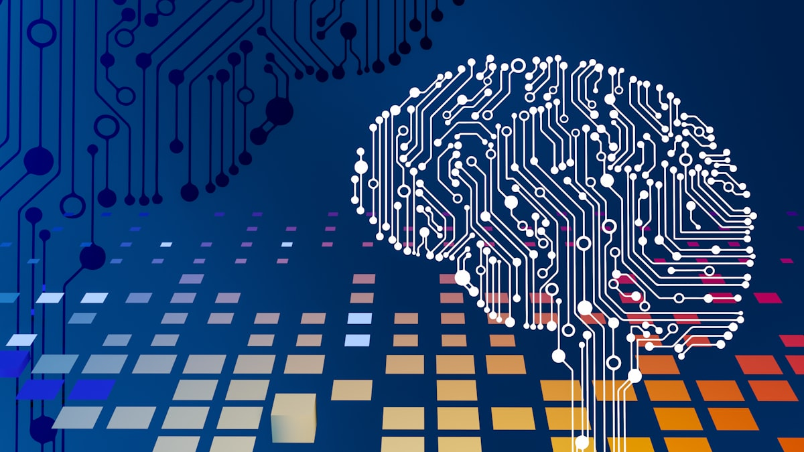

{width=100%}

## Apresentação

**AI Applications** é a disciplina de fechamento do MBA: um **laboratório aplicado** que consolida o aprendizado técnico em aplicações concretas e integradas de IA no contexto de negócios reais, conectando tecnologia com **valor entregue** para o negócio.

A proposta é sair do conceito e chegar ao produto — conceber, prototipar e apresentar soluções completas de IA, embarcando modelos em fluxos de ponta a ponta.

## Temas abordados

- **Design de soluções de IA orientadas a valor** — do problema ao produto;
- **Cases reais por setor** — varejo, saúde, finanças, indústria e serviços;
- **Integração de múltiplas tecnologias** — ML + LLMs + dados + automação;
- **Prototipagem rápida** com ferramentas *no-code* e *low-code* de IA;
- **Apresentação e defesa** de soluções de IA para *stakeholders* executivos.

## Objetivo final

Ao concluir a disciplina, o aluno será capaz de **conceber, prototipar e apresentar soluções completas de IA** para problemas reais de negócio, demonstrando domínio integrado de todos os conceitos aprendidos ao longo do programa.
