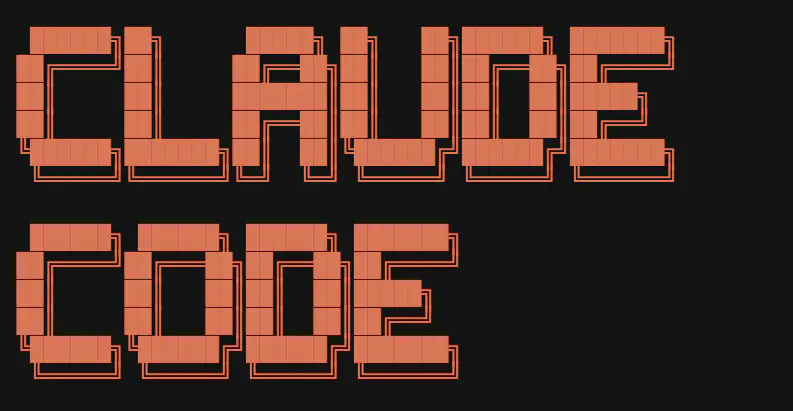

{width=100%}

## Apresentação

A **Imersão Claude Code para Economistas, Administradores e Contadores** é um curso de **cinco encontros** (26/05 a 23/06 de 2026) que parte do zero — muitos alunos **nunca abriram um terminal** — e chega à construção de um agente em produção.

O fio condutor é a replicação do **Digest do Boletim AM**: um agente real que coleta newsletters por e-mail (IMAP), sintetiza o conteúdo com **Claude Opus 4.7** e entrega um PDF semanal no WhatsApp, tudo orquestrado por **GitHub Actions**. Em vez de exemplos artificiais, o aluno reconstrói um pipeline que já roda na nuvem.

> O objetivo não é virar programador, mas aprender a **delegar trabalho a um agente** — descrever o que se quer, revisar o que ele faz e colocar o resultado em produção.

## Calendário

| Encontro | Data | Foco |
|---|---|---|
| Aula 1 | 26/05/2026 | Fundamentos, anatomia do Claude Code e setup |
| Monitoria | 29/05/2026 | Tira-dúvidas de instalação |
| Aula 2 | 02/06/2026 | Demonstração do Digest ao vivo + setup completo |
| Aula 3 | 09/06/2026 | Construção do projeto |
| Aula 4 | 16/06/2026 | Pipeline e automação |
| Aula 5 | 23/06/2026 | Produção e próximos passos |

## Stack de referência

A stack do curso espelha **exatamente** a do Digest em produção — replicar o ambiente da nuvem evita o clássico "funciona na minha máquina, quebra no servidor":

- **Python 3.12** (mesma versão do GitHub Actions);
- **Node 20+** (runtime que a extensão Claude Code usa por baixo);
- **Claude Opus 4.7** com `thinking={"type": "adaptive"}` e `effort: high`, via `client.messages.stream(...)`;
- **Bibliotecas:** `imap_tools>=1.7`, `beautifulsoup4>=4.12`, `anthropic>=0.40`, `python-dotenv>=1.0`, `python-dateutil>=2.9`;
- Credenciais sempre em `.env` (nunca no código), com `.env` no `.gitignore`.

---

## Aula 01 — Fundamentos, anatomia e setup

> *26 de maio de 2026*

Primeiro contato com o ferramental e instalação do ambiente em qualquer sistema operacional.

- **Fundamentos rápidos** — o que são LLMs, noções de *prompting* e como Claude se compara a GPT e Gemini;
- **Anatomia do Claude Code** — o loop agêntico, *tools*, janela de contexto e escolha de modelos;
- **Setup ao vivo** — passo a passo para **macOS, Windows e Linux**: Python 3.12, Node 20+, Git, VS Code, a extensão Claude Code, ambiente virtual (`.venv`) e dependências do Digest;
- **Demonstração do Digest** — visão geral do pipeline real em produção;
- **Plano B** — quem se assusta com o terminal pode **delegar a própria instalação ao agente**.

## Aula 02 — O Digest ao vivo e setup completo

> *2 de junho de 2026*

Demonstração do agente em funcionamento e finalização do ambiente de cada aluno, para que todos sigam a partir da mesma base.

## Aula 03 — Construção do projeto

> *9 de junho de 2026*

Mãos à obra: começar a montar, com o Claude Code, as peças do agente — leitura de e-mails via `imap_tools` (sempre com `mark_seen=False`), limpeza do HTML e estruturação do conteúdo.

## Aula 04 — Pipeline e automação

> *16 de junho de 2026*

Síntese com Claude Opus, geração do entregável e orquestração do fluxo de ponta a ponta.

## Aula 05 — Produção e próximos passos

> *23 de junho de 2026*

Colocar o agente para rodar sozinho na nuvem via **GitHub Actions**, boas práticas de credenciais e segredos, e os caminhos para evoluir o projeto depois do curso.

---

## Materiais

- **Índice da imersão:** <https://analisemacro.github.io/imersao-claude-code/>
- **Aula 01 (26/05):** <https://analisemacro.github.io/imersao-claude-code/aula01-26052026.html>
- **Aula 02 (02/06):** <https://analisemacro.github.io/imersao-claude-code/aula02-02062026.html>

> As Aulas 03–05 entram como páginas próprias no site da imersão, sem alterar as URLs das anteriores.
