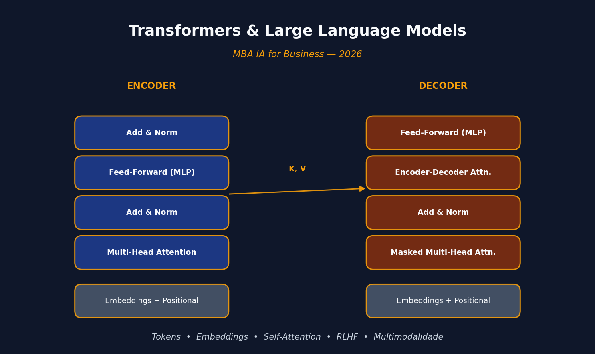

{width=100%}

## Apresentação

Este curso foi ministrado em **quatro encontros de ~3h40** (26/03, 31/03, 02/04 e 07/04 de 2026) para a turma de **MBA IA for Business**. O fio condutor é simples: explicar, sem matemática pesada, **por que** a arquitetura Transformer destravou a revolução da IA generativa em linguagem, **como** ela funciona internamente, e **quais** as consequências econômicas e estratégicas disso para o mercado.

> Ementa resumida — detalhar a arquitetura Transformer e os LLMs, a tecnologia específica que impulsionou a revolução da IA generativa em linguagem. Compreender como esses modelos funcionam é essencial para usá-los estrategicamente.

### Temas abordados ao longo das quatro aulas

- **Panorama geral da IA**: cronologia e oportunidades;
- **Arquitetura Transformer**: atenção, tokens e embeddings (sem matemática);
- **Como LLMs são treinados**: dados, RLHF e alinhamento com intenção humana;
- **Capacidades emergentes**: raciocínio, geração de código e multimodalidade;
- **Contexto e memória**: limitações de janela de contexto e estratégias de contorno;
- **Principais LLMs do mercado**: GPT, Claude, Gemini, Llama — diferenças e posicionamento.

### Avaliação

- Trabalho aplicado sobre temas vistos na disciplina — **80%** da nota;
- Participação nas aulas — **20%**;
- Entrega via Google Classroom até **17 de abril**.

---

## Aula 01 — De Modelos de Linguagem a Grandes Modelos de Linguagem

> *26 de março de 2026*

A primeira aula situou o aluno no mapa. IA não é mágica — **é estatística com ambição**. Sobreposta a essa definição, existe uma hierarquia que é útil manter à mão:

- **IA** — qualquer sistema que "pensa" ou decide como um humano (Netflix, Waze, ChatGPT);
- **Machine Learning** — a máquina aprende padrões a partir de dados, em vez de receber regras prontas;
- **Redes neurais** — modelos inspirados no cérebro, conectando "neurônios" artificiais para padrões complexos;
- **Deep learning** — redes neurais muito maiores e mais profundas;
- **IA generativa** — IA que *cria* (texto, imagem, código, música);
- **LLMs** — modelos treinados com enormes quantidades de texto para entender e gerar linguagem.

A tese central, emprestada de **Chip Huyen**, é que a palavra que define a IA pós-2020 é **escala**. Essa escala tem duas consequências:

1. Modelos cada vez mais capazes permitem que mais pessoas e equipes gerem produtividade e valor econômico.
2. Treinar LLMs exige dados, computação e talento que só algumas organizações conseguem bancar — e daí surge o **modelo como serviço**: os LLMs são disponibilizados por API para que todo mundo construa aplicações sem precisar treinar o seu próprio.

> *A demanda por aplicações de IA aumentou, enquanto a barreira de entrada caiu — e a engenharia de IA virou uma das disciplinas que mais crescem.*

### Tokens, vocabulário e tokenização

A unidade básica de um modelo de linguagem é o **token** — pode ser um caractere, uma palavra inteira, ou uma parte de palavra como `-tion`. O GPT-4, por exemplo, divide "You can't judge an ice cream by its flavor" em 9 tokens, com ~¾ de palavra por token em média. O conjunto de todos os tokens reconhecidos pelo modelo é o seu **vocabulário** (32.000 no Mixtral 8x7B; 100.256 no GPT-4).

Por que token e não palavra? Três motivos:

1. **Composicionalidade** — `cooking` → `cook` + `ing` preserva significado;
2. **Eficiência** — menos tokens únicos do que palavras únicas, logo vocabulário menor;
3. **Robustez** — palavras inventadas como `chatgpting` ganham uma estrutura legível.

### Duas famílias de modelos de linguagem

| Tipo | O que prevê | Exemplo | Uso típico |
|---|---|---|---|
| **Mascarado** | Token ausente em qualquer posição (contexto dos dois lados) | BERT | Classificação, NER, recuperação |
| **Autorregressivo** | Próximo token, usando apenas os anteriores | GPT | Geração de texto |

Os autorregressivos dominam porque geram texto continuamente — e a "conclusão" é uma operação incrivelmente geral: tradução, resumo, código e resolução de problemas podem todos ser enquadrados como completar um prompt.

### Autosupervisão — a virada de chave

O sucesso dos modelos de IA da década de 2010 (AlexNet et al.) dependia de rotulagem **supervisionada**: rotular 1 milhão de imagens a 5 centavos cada custa US$ 50 mil. Escalar a 1 milhão de categorias, US$ 50 milhões. Inviável.

A modelagem de linguagem é **autosupervisionada**: cada sequência de texto já carrega os rótulos (o próximo token) dentro de si. Isso elimina o gargalo da rotulagem — e é por isso que LLMs escalaram de forma que modelos de visão computacional *supervisionados* nunca conseguiram.

### De LLMs a "Modelos de Fundação"

Linguagem sozinha não basta para operar no mundo real: é preciso ver, ouvir e processar outras modalidades. Daí surgem os **modelos de fundação** (GPT-4V, Claude 3, Gemini) que aceitam texto + imagem + às vezes áudio, vídeo, 3D, proteínas. Um modelo multimodal generativo também é chamado **LMM** (*Large Multimodal Model*).

---

## Aula 02 — Tokens, Embeddings e Atenção

> *31 de março de 2026*

A segunda aula mergulha em **como o modelo representa linguagem numericamente** e **por que a atenção mudou tudo**.

### Do Bag of Words ao word2vec

A forma mais ingênua de transformar texto em número é o **bag of words**: tokeniza, monta um vocabulário e conta quantas vezes cada palavra aparece em cada frase. Funciona, mas ignora completamente o significado — é literalmente um saco.

O **word2vec** (2013) foi a primeira tentativa bem-sucedida de capturar o **significado** das palavras em vetores. A ideia: treinar uma rede neural pequena para prever se duas palavras são vizinhas em uma frase. Se são vizinhas com frequência, seus vetores (*embeddings*) ficam próximos no espaço. O resultado surpreendente é que propriedades semânticas emergem naturalmente — "bebê" e "recém-nascido" ficam próximos; "banco" fica em algum lugar entre "instituição financeira" e "margem de rio".

Embeddings permitem **medir semelhança semântica** com métricas de distância vetorial — é assim que sistemas de busca e recomendação modernos funcionam por baixo dos panos.

### O limite do word2vec: representações estáticas

word2vec gera embeddings **estáticos**: a palavra "banco" tem sempre o mesmo vetor, independentemente de estar em "banco central" ou "banco do rio". Isso é um problema — o significado deveria mudar com o contexto.

### Contexto com RNNs

Um primeiro passo em direção ao contexto foi dado pelas **Redes Neurais Recorrentes (RNNs)**, usadas em arquiteturas *encoder-decoder* para tradução automática. O encoder lê a frase palavra por palavra e comprime tudo em um vetor de contexto; o decoder, a partir desse vetor, gera a tradução token a token de forma autorregressiva.

O problema: comprimir uma frase inteira em um único vetor é cruel para frases longas — o modelo esquece o começo quando chega no fim.

### Atenção (2014) e "Attention Is All You Need" (2017)

Em 2014, surgiu a **atenção**: em vez de passar um único vetor de contexto ao decoder, passam-se os estados ocultos de **todas** as palavras de entrada, e o decoder aprende a "prestar atenção" seletivamente nas partes relevantes para cada token que está gerando.

Em 2017, Vaswani et al. publicam **"Attention Is All You Need"** e propõem o **Transformer**: uma arquitetura que **elimina a recorrência** e usa exclusivamente atenção. Duas consequências imediatas:

1. **Paralelização** — sem a dependência sequencial do RNN, o treinamento pode rodar em paralelo em GPUs, acelerando tremendamente;
2. **Self-attention** — cada token atende a todos os outros da mesma sequência simultaneamente, capturando dependências de longo alcance sem degradação.

O bloco básico do Transformer tem duas partes: **self-attention** seguida de uma **rede feedforward (MLP)**. O decoder adiciona uma camada extra que atende à saída do encoder. Essa arquitetura é a base de BERT, GPT e virtualmente tudo que veio depois.

---

## Aula 03 — A Arquitetura Transformer por Dentro

> *2 de abril de 2026*

A terceira aula desmonta o Transformer peça por peça e amarra tudo com um exemplo concreto em português macroeconômico.

### Encoder, Decoder e três arquiteturas derivadas

O Transformer original é **encoder-decoder**:

- **Encoder** (o "leitor") — processa toda a sequência de entrada e produz uma representação rica em contexto, token por token;
- **Decoder** (o "escritor") — consome essa representação e gera a sequência de saída autorregressivamente.

A arquitetura se desdobrou em três variantes, cada uma otimizada para uma classe de tarefas:

| Arquitetura | Tarefas | Modelos |
|---|---|---|
| **Só encoder** | Compreensão: classificação, análise de sentimento, NER, busca | BERT |
| **Só decoder** | Geração autorregressiva de texto | GPT, Claude, Gemini, Llama |
| **Encoder-decoder** | Tradução, sumarização | T5, BART |

Cada um desses modelos é uma **pilha de blocos Transformer** — 6 no artigo original, mais de 100 nos LLMs modernos.

### Um bloco Transformer por dentro

```
Input tokens → Embeddings + Positional Encoding
             ↓
     ┌─────────────────────────┐
     │  Multi-Head Self-Attn   │
     └─────────────┬───────────┘
                   ↓
             Add & Norm  (residual + layernorm)
                   ↓
     ┌─────────────────────────┐
     │  Feed-Forward (MLP)     │
     └─────────────┬───────────┘
                   ↓
             Add & Norm
                   ↓
            (próximo bloco ou LM Head)
```

#### 1. Tokenização e embedding

O texto vira tokens, e cada token vira um vetor numérico de alta dimensão — o **embedding**. Geometria passa a ser a linguagem de trabalho: palavras com significados parecidos ficam próximas no espaço vetorial.

#### 2. Self-attention — o coração do Transformer

A cada token a rede calcula três vetores:

- **Query (Q)** — o token que "pergunta" quais outros tokens são relevantes para ele;
- **Key (K)** — o que cada token "é", o que ele oferece como conteúdo;
- **Value (V)** — a informação propriamente dita, caso a Key seja considerada relevante.

O produto Q × K determina **pesos de atenção**; esses pesos combinam os V's para formar a nova representação contextualizada de cada token. **Atenção é relevância contextual dinâmica** — o mesmo token pode atender a coisas diferentes dependendo da frase.

#### 3. Positional Encoding

Self-attention puro não sabe a ordem dos tokens — para ele, "o gato dorme" e "dorme o gato" são iguais. O **Positional Encoding** soma aos embeddings uma assinatura numérica única por posição, fazendo com que a ordem volte a importar.

#### 4. Feed-Forward (MLP)

Depois da atenção, cada token passa por uma MLP aplicada posição a posição. É onde o modelo **refina localmente** a representação global gerada pela atenção — captando padrões não-lineares e nuances sutis.

#### 5. Multi-Head Attention

Em vez de uma única operação de atenção, o Transformer roda **várias em paralelo** (multi-head). Cada cabeça aprende a capturar um tipo de relação:

- uma foca em dependências curtas ("o gato" → "dorme");
- outra rastreia coreferências longas ("ela" → "Maria" 12 tokens atrás);
- outra pega relações semânticas ou gramaticais.

#### 6. Saída: Linear + Softmax

A saída do último bloco passa por uma camada linear que projeta no tamanho do vocabulário, e uma **softmax** converte em uma distribuição de probabilidades sobre o próximo token.

### Um exemplo concreto — macroeconomia em português

Frase de entrada:

> **"O Banco Central aumentou a taxa de juros porque..."**

Passando pelo **encoder**:

1. **Embeddings** — `["O", "Banco", "Central", "aumentou", "a", "taxa", "de", "juros", "porque"]` vira uma matriz de vetores. "Banco Central", "juros" e "aumentou" ficam próximos no espaço — o modelo vê política monetária.
2. **Positional Encoding** — "aumentou juros" ≠ "juros aumentaram o Banco Central" (caos macroeconômico).
3. **Multi-head attention** — "porque" espera causalidade; "Banco Central" se conecta a "juros"; o modelo identifica que estamos em *policy making*.
4. **Add & Norm** — estabiliza o aprendizado (o Copom tentando não perder o controle).
5. **MLP** — refina: *"isso aqui é sobre decisão de política monetária em reação a algo"*.

No **decoder**:

1. **Masked self-attention** — só olha para o passado gerado (não pode espiar o gabarito);
2. **Attention cruzada com o encoder** — "qual parte da entrada explica o próximo token?";
3. **Linear + softmax** — distribuição sobre o vocabulário:
   - `inflação: 80%`
   - `desemprego: 10%`
   - `câmbio: 10%`

Saída: **"a inflação estava acima da meta"**.

### Treinamento, RLHF e raciocínio

- **Pré-treino** — prever o próximo token em bilhões de exemplos; ajustar pesos por gradiente descendente. *"Não tem consciência, tem otimização."*
- **RLHF** (*Reinforcement Learning with Human Feedback*) — humanos avaliam respostas, o modelo aprende o que é útil, seguro e claro. *"É onde o modelo aprende a parecer inteligente."*
- **Raciocínio** — quando o modelo responde *"...porque a inflação estava acima da meta"*, o que parece raciocínio é na verdade padrão aprendido + cadeia de probabilidade. *O modelo não pensa, ele simula pensamento.*

### Multimodalidade, contexto e memória

- **Multimodalidade** — texto, imagem e áudio viram embeddings no **mesmo espaço vetorial**, e o modelo gera o próximo token condicionado a qualquer mistura.
- **Contexto** — o modelo enxerga apenas o que está dentro da **janela de contexto** (ex.: 8k, 200k, 1M tokens). Fora disso, esquece. Não é memória real, é contexto temporário.
- **Estratégias para contornar a janela**:
  - **RAG** (*Retrieval-Augmented Generation*) — buscar documentos externos e injetar no prompt;
  - **Resumos iterativos** — comprimir o histórico antigo;
  - **Chunking** — quebrar texto longo em pedaços;
  - **Chain of thought** — forçar raciocínio passo a passo;
  - **Agentes** — loops de decisão que decidem o que buscar/recordar (o hype atual).

> *Transformers não entendem o mundo. Eles entendem padrões. E, surpreendentemente, isso é suficiente para parecer inteligência.*

---

## Aula 04 — O Modelo de Negócios dos LLMs

> *7 de abril de 2026*

A última aula tira o Transformer do laboratório e coloca no mercado: quem ganha dinheiro com isso, onde está a cadeia de valor, e o que isso significa para a carreira de quem está escutando.

### Modelo como Serviço — retomada

A escala dos LLMs tem duas consequências econômicas já discutidas na Aula 01:

1. A IA fica mais poderosa → mais aplicações possíveis;
2. Treinar LLMs custa tanto que só umas poucas organizações conseguem — e elas passam a *vender o modelo como serviço* via API.

### O que é um LLM "de verdade"

- **Tokens, embeddings, atenção** — as três pernas técnicas;
- O que torna o modelo **grande** são quatro eixos: *parâmetros*, *dados*, *contexto* e *capacidade de generalização*;

> *LLM não entende. Ele prevê. E isso já é suficiente para mudar o mundo.*

### Cadeia de valor dos LLMs

| Camada | Quem está lá | O que faz |
|---|---|---|
| **Infraestrutura** | NVIDIA (GPUs); AWS, Azure, GCP (cloud) | Vende o "picareta e pá" |
| **Modelos fundacionais** | OpenAI, Anthropic, Google, Meta, xAI, Mistral | Treina e opera os LLMs |
| **Aplicações** | Chatbots, copilots, agentes, verticais | Monta produtos sobre as APIs |

> *Quem controla a infraestrutura controla o jogo. Quem controla o modelo define as regras.*

### Os principais players

| Modelo | Força | Fraqueza | Estratégia | Posicionamento |
|---|---|---|---|---|
| **GPT** (OpenAI) | Equilíbrio geral, ecossistema forte (API + apps) | Dependência da Microsoft; custo | Produto + plataforma | *"Apple da IA — controle de experiência"* |
| **Claude** (Anthropic) | Raciocínio limpo, contexto longo absurdo, foco em segurança | Menos popular no varejo | Segurança + contexto | *"O filósofo da turma — pensa antes de falar"* |
| **Gemini** (Google) | Multimodalidade forte, dados, distribuição | Inconsistência | Integração total com ecossistema | *"Não precisa ganhar. Só não pode perder."* |
| **Llama** (Meta) | Flexibilidade, customização | Performance de ponta menor | Open-source (quase) | *"Linux da IA"* |

### Guerra, futuro e oportunidade

Três eixos de disputa simultâneos:

- **Open vs. fechado** — Llama, Mistral, DeepSeek vs. OpenAI, Anthropic, Google;
- **Big Tech vs. startups** — quem absorve quem;
- **Infra vs. aplicação** — onde fica a margem.

> *LLM não é produto final. É commodity em formação.*

**Tendências:**

- **Agentes** — autonomia ganhando espaço sobre chat;
- **Modelos menores e especializados** — fine-tune > um-tamanho-serve-todos;
- **Integração com dados proprietários** — *moat* real está nos dados;
- **Fine-tuning vs. prompting** — prompting resolve mais do que parece.

> *Quem não tem dado próprio vai virar usuário — não player.*

### O que isso significa para a carreira

Sem romantismo, três perfis que sobrevivem à transição:

1. **Construtores** — criam sistemas com LLMs (engenharia de IA aplicada);
2. **Tradutores** — conectam negócio ↔ tecnologia (quem decide *onde* usar);
3. **Donos de dados** — têm acesso exclusivo a corpora que ninguém mais tem.

> *Aprender ferramenta é tática. Entender o jogo é estratégia.*

### Dois exemplos aplicados

A aula fecha com dois estudos de caso trazidos da prática da Análise Macro:

- **Exemplo 1 — IA vs. modelos clássicos**: quando um LLM bate um modelo estatístico tradicional (e quando não bate). A comparação força a aula a descer do hype: LLMs são poderosíssimos em linguagem, mas não substituem um modelo econométrico bem especificado para previsão de série temporal estacionária.
- **Exemplo 2 — Agente de Saúde**: um agente construído para operar no domínio médico, articulando busca, raciocínio e ações. Mostra na prática o salto do "chat" para "agente" e como a metodologia CRISP-DM se adapta quando o "modelo" é um LLM orquestrado.

---

## Leitura e referências centrais

Material-base usado na preparação das aulas:

- **Vaswani et al. (2017)**, *"Attention Is All You Need"* — o artigo que definiu a arquitetura;
- **Chip Huyen**, *"AI Engineering: Building Applications with Foundation Models"* — referência para o enquadramento de engenharia de IA e modelo como serviço;
- **Jay Alammar & Maarten Grootendorst**, *"Hands-On Large Language Models"* — referência para as visualizações de tokens, embeddings e atenção;
- **Shannon (1951)**, *"Prediction and Entropy of Printed English"* — raiz histórica da modelagem estatística de linguagem;
- Documentação técnica dos LLMs discutidos: **OpenAI GPT**, **Anthropic Claude**, **Google Gemini** e **Meta Llama**.

---

## Material do curso

Os slides originais das quatro aulas estão disponíveis em PDF e PPTX no diretório `teaching/Transformers/` deste repositório:

- `Aula01_26032026` — Panorama da IA, Modelos de Linguagem a LLMs, Modelos de Fundação;
- `Aula02_31032026` — Tokens, Embeddings, Atenção e o artigo *Attention Is All You Need*;
- `Aula03_02042026` — Arquitetura Transformer por dentro, exemplo macroeconômico, RLHF e memória;
- `Aula04_07042026` — Modelo como serviço, cadeia de valor, principais players e oportunidades de carreira.
